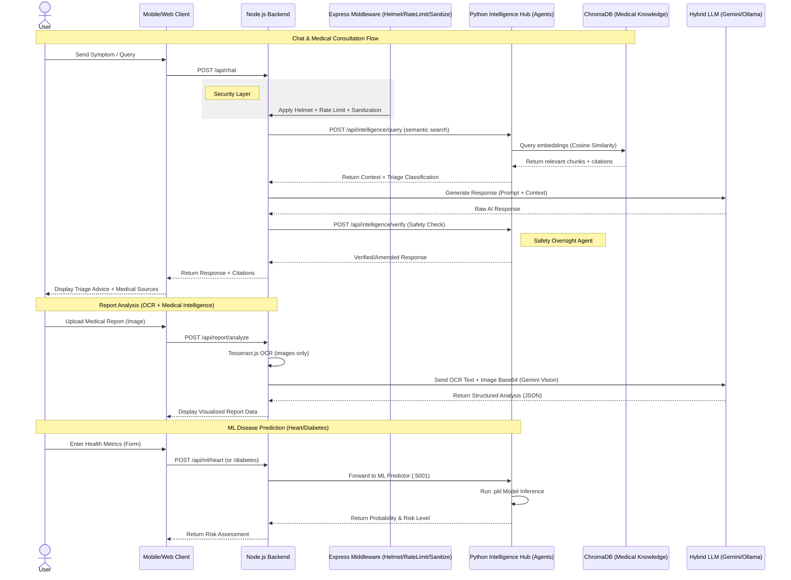
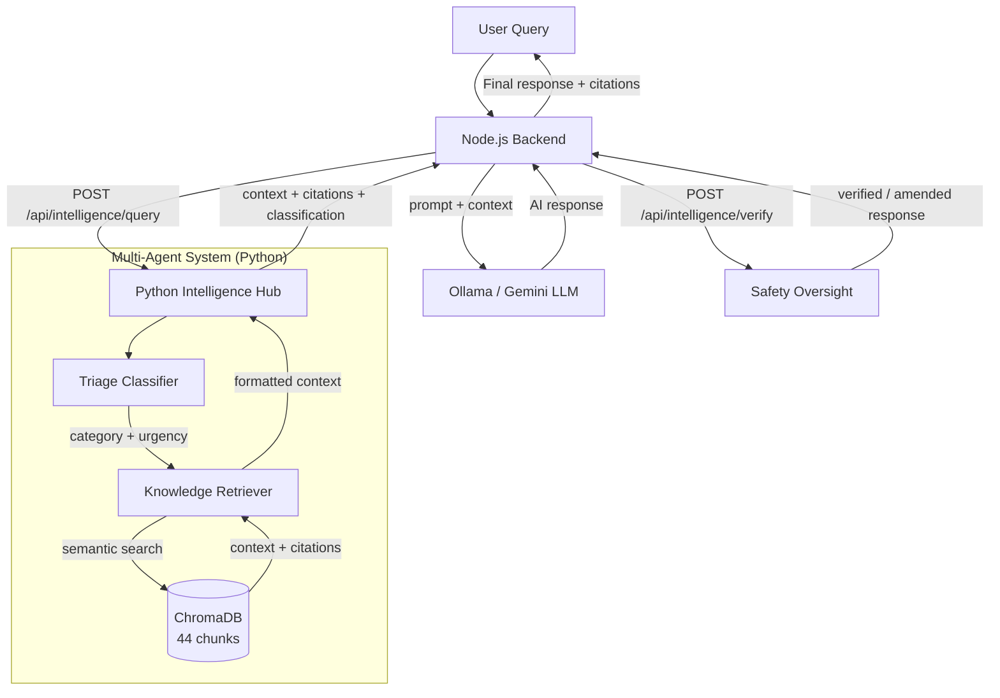

# Aether Clinic: AI-Powered Healthcare System

A comprehensive, privacy-first healthcare platform integrating React Native Mobile, Modern Web Clients, Node.js Backend, and Python ML Services.

## Detailed System Workflows



---

## High-Level Architecture

The system operates on a multi-agent microservices architecture where the Node.js backend acts as the orchestrator between user clients and a specialized Python Intelligence Hub.


---

## Intelligence Hub (Multi-Agent RAG)

### Architecture Overview
The Multi-Agent RAG system uses semantic search and specialized agents to provide accurate, cited medical guidance.

**Technologies**: Python, Flask, LangGraph, ChromaDB, Sentence-Transformers

**Agentic Framework**:
- **Triage Classifier**: Categorizes queries and detects emergency urgency levels.
- **Knowledge Retriever**: Performs hybrid semantic search against a Vector DB (ChromaDB) containing 44+ medical knowledge chunks.
- **Safety Oversight**: Post-processes AI responses to detect hallucinations and ensure mandatory safety warnings are present.

### Internal Agent Workflow
The following diagram illustrates the internal decision-making and data retrieval flow within the Intelligence Hub.



### Implementation Details

#### New Files (Python ML Service)
| File | Purpose |
|:-----|:--------|
| ingestion_service.py | Reads corpus, chunks, generates embeddings, and stores in ChromaDB |
| agents/init.py | Package initialization |
| agents/triage_classifier.py | Routes queries by medical category and urgency |
| agents/knowledge_retriever.py | Semantic search and hybrid retrieval |
| agents/safety_oversight.py | Final verification of AI response safety |
| data/medical_corpus/*.txt | Clinical guidelines for Cardiology, Endocrinology, General Medicine, Orthopedics, Pulmonology, and Mental Health |

#### Modified Files (Node.js Backend)
| File | Change |
|:-----|:--------|
| ragService.js | Rewritten as Intelligence Hub client with fallback capability |
| chatController.js | Integrated async intelligence retrieval and safety verification |
| mlRoutes.js | Added intelligence status monitor endpoint |

#### API Endpoints
| Method | Endpoint | Service | Description |
|:-------|:---------|:--------|:------------|
| POST | /api/intelligence/query | Python :5001 | Multi-agent RAG workflow |
| POST | /api/intelligence/verify | Python :5001 | Safety oversight verification |
| GET | /api/intelligence/status | Python :5001 | System health dashboard |
| GET | /api/ml/intelligence/status | Node :5050 | Proxied status check |

### Ingestion Statistics
- **6 Corpus Files**: Covering 9 medical specializations.
- **17 Medical Protocols**: Sourced from WHO, AHA, ADA, GINA, APA, NICE, CDC, and others.
- **44 Indexed Chunks**: High-dimensionality semantic embeddings.
- **Embedding Model**: all-MiniLM-L6-v2 (384 dimensions).

### Workflow: How to Run
```bash
# 1. Ingest medical knowledge (one-time or when adding new protocols)
cd ml && python3 ingestion_service.py

# 2. Start the ML + Intelligence Hub service
cd ml && python3 app.py

# 3. Start the Node.js backend (auto-connects to Intelligence Hub)
cd server && npm run dev
```

> [!NOTE]
> If the Intelligence Hub is unavailable, the system gracefully falls back to the legacy keyword-based retrieval system for maximum reliability.

---

## Key System Components

### Mobile App
- **Technologies**: React Native, Expo, Reanimated
- **Description**: Patient-facing app for health monitoring, AI consultation, and report digitization.

### Web Client
- **Technologies**: React, Vite, TailwindCSS
- **Description**: Clinical dashboard for healthcare providers to review patient analytics and management.

### Backend API (Gateway)
- **Technologies**: Node.js, Express, MongoDB
- **Description**: Orchestration layer for security, OCR processing, and agentic communication.

### ML Predictor
- **Technologies**: Python, Flask, Scikit-Learn
- **Description**: Risk assessment for heart disease and diabetes using pre-trained models.

---

## Security & Privacy Architecture
- **Zero-Knowledge Intelligence**: Local LLM processing (Ollama) for routine consultations.
- **AES-256 Encryption**: Hardware-isolated encryption for all sensitive communication logs.
- **Agentic Safety Guardrails**: Real-time cross-referencing against clinical guidelines to prevent dangerous recommendations.

---

## Repository Structure
- **/mobile**: Patient application (React Native).
- **/client**: Dashboard application (React + Vite).
- **/server**: Backend orchestration and security.
- **/ml/agents**: Triage, Retrieval, and Safety agent source code.
- **/ml/data/medical_corpus**: Source clinical guidelines for RAG.

---
*Building for a safer, smarter future of healthcare.*
