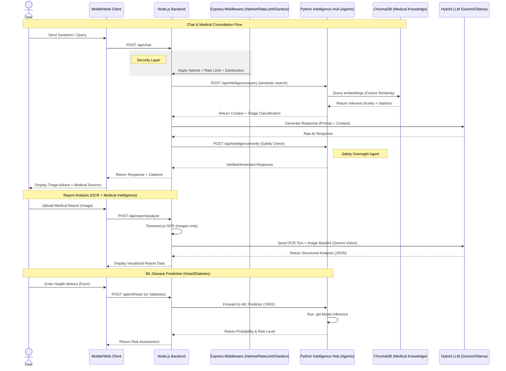
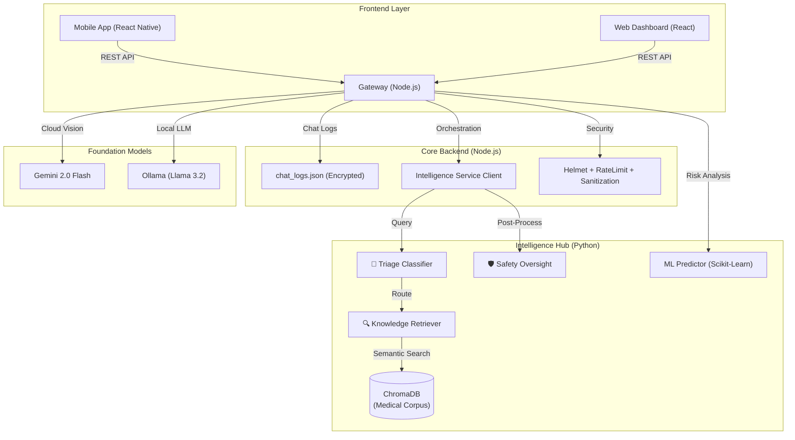

# Aether Clinic: AI-Powered Healthcare System

A comprehensive, privacy-first healthcare platform integrating React Native Mobile, Modern Web Clients, Node.js Backend, and Python ML Services.

## Detailed System Workflows

---

## High-Level Architecture

The system operates on a multi-agent microservices architecture where the Node.js backend acts as the orchestrator between user clients and a specialized Python Intelligence Hub.

---

## Key System Components

### Mobile App
- **Technologies**: React Native, Expo, Reanimated
- **Description**: Patient-facing app providing a secure interface for health monitoring, AI-driven consultation, and medical report digitization.

### Web Client
- **Technologies**: React, Vite, TailwindCSS
- **Description**: Clinical dashboard for healthcare providers to review patient analytics, manage clinic data, and oversee health trends.

### Backend API (Gateway)
- **Technologies**: Node.js, Express, MongoDB
- **Description**: Central orchestration layer managing authentication, middleware security, OCR processing, and communication between specialized AI agents and frontend clients.
- **Data Persistence**: Sensitive chat data is encrypted (AES-256) and persisted across sessions.

### Intelligence Hub (Multi-Agent RAG)
- **Technologies**: Python, Flask, LangGraph, ChromaDB, Sentence-Transformers
- **Architecture**: A specialized agentic framework consisting of:
  - **🏥 Triage Classifier**: Categorizes queries and detects emergency urgency.
  - **🔍 Knowledge Retriever**: Performs hybrid semantic search against a Vector DB (ChromaDB) containing 44+ medical knowledge chunks.
  - **🛡️ Safety Oversight**: Post-processes AI responses to detect hallucinations and ensure mandatory safety warnings (e.g., Dengue/NSAID warning).

### ML Engine
- **Technologies**: Python, Flask, Scikit-Learn, Joblib
- **Description**: Predictive engine for high-fidelity health risk assessments (Heart Disease and Diabetes) using pre-trained Scikit-Learn models.

### Foundation LLMs
- **Technologies**: Google Gemini (Cloud), Ollama (Local)
- **Description**: Hybrid intelligence utilizing Gemini 2.0 Flash for vision/complex analysis and Llama 3.2 (Local) for privacy-first routine consultations.

---

## Security & Privacy Architecture

Aether Clinic implements a multi-layered security posture designed for healthcare compliance and data integrity.

- **Zero-Knowledge Architecture**: Routine consultations are processed locally (Ollama) to ensure sensitive health data remains on secure infrastructure.
- **AES-256 Encryption**: Every message in the chat logs depends on a 64-character hex key for hardware-isolated encryption.
- **Agentic Safety Oversight**: Every AI response is cross-checked by a specialized Python agent against clinical guidelines to prevent the recommendation of dangerous medications or missing "Red Flag" warnings.
- **Ephemeral Image Processing**: Vision analysis (Gemini) occurs in-memory; images are never persisted in cloud storage.
- **Rate Limiting & Sanitization**: Rigorous protection against NoSQL injection and DoS attacks at the Gateway level.

---

## Repository Structure

- **/mobile**: Patient application source code (React Native).
- **/client**: Clinical dashboard source code (React + Vite).
- **/server**: Node.js backend, security middleware, and agent orchestration.
- **/ml**: Python Intelligence Hub, agents, ChromaDB, and ML models.
  - **/agents**: Source code for Triage, Retrieval, and Safety agents.
  - **/data/medical_corpus**: Source clinical guidelines for RAG.
- **/k8s**: Deployment manifests for Kubernetes orchestration.

---
*Building for a safer, smarter future of healthcare.*
