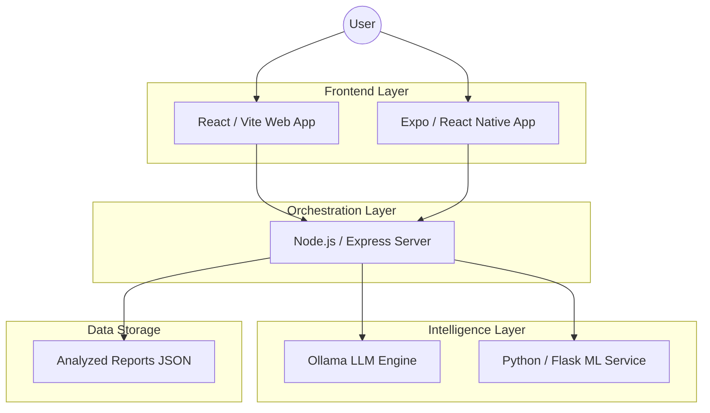

# Aether Clinic 🛰️

**Aether Clinic** is a next-generation, AI-powered healthcare intelligence system designed to provide accessible, high-tech, and private medical guidance. It combines advanced Machine Learning with a futuristic, holographic user experience.

---

## 🌌 Project Overview

Aether Clinic bridges the gap between individuals and reliable medical guidance. In regions with limited healthcare access, language barriers, or high costs, Aether Clinic provides instant, trustworthy, and easy-to-understand medical insights.

It acts as a **digital immune system**, helping users understand symptoms, identify risks, and interpret medical reports using state-of-the-art AI.

---

## 🏗️ System Architecture

Aether Clinic is built as a modular microservices architecture, ensuring privacy by running heavy AI workloads locally.



### 🛠️ Core Workflow
1.  **Ingestion**: User Input via futuristic HUD (Text/Image).
2.  **Processing**: Node.js Backend orchestrates requests.
3.  **Intelligence**: 
    -   **Chat**: Ollama (Llama 3.2) provides clinical reasoning.
    -   **Reports**: Llama 3.2 Vision + Tesseract OCR analyze physical documents.
    -   **Risks**: Python Scikit-learn models predict specific health risks (Heart/Diabetes).
4.  **Visualization**: Results rendered with cinematic motion and HUD overlays.

---

## ⚡ Key Features

- **Holographic Dashboard**: A high-tech HUD with mouse-tracking "Flashlight" reveal and Nano-bot swarm interactions.
- **3D Specialist Carousel**: Navigate medical specialists in a futuristic 3D carousel.
- **AI Chatbot 2.0 ("The Session")**: A holographic command center for medical consultation powered by Llama 3.2.
- **Vision Report Scanner**: A "Holographic Laser Scanner" that uses **Llama 3.2 Vision** and OCR to analyze medical reports (blood tests, etc.) from images.
- **Disease Risk Assessment**: ML models for specific health risk predictions (Heart, Diabetes).
- **Cinematic Experience**: Dossier-style About page with motion-tracked HUD overlays.

---

## 🛠️ Technology Stack

### Application Layer
- **Frontend**: React (Vite), Tailwind CSS, Framer Motion, Axios.
- **Backend**: Node.js, Express.
- **AI/LLM**: **Ollama** (Llama 3.2 & Llama 3.2 Vision).
- **OCR**: Tesseract.js.
- **ML Microservice**: Python, Flask, Scikit-learn.

### DevOps & Infrastructure
- **Containerization**: Docker (Multi-service setup with Docker Compose).
- **Orchestration**: Kubernetes (Workload Jobs for batch ML inference).
- **Environment**: Local LLM execution for absolute data privacy.

---

## 🚀 Getting Started

### Prerequisites
- [Node.js](https://nodejs.org/) (v18+)
- [Docker](https://www.docker.com/) & Docker Compose
- [Ollama](https://ollama.com/) (Running locally or in container)

### Quick Start (Local)

1. **Clone the repository**
   ```bash
   git clone https://github.com/yashsrivastava1408/Aether-Clinic.git
   cd ai-doctor-final
   ```

2. **Run with Docker Compose**
   ```bash
   docker-compose up --build
   ```

3. **Install AI Models** (If not already present in Ollama container)
   ```bash
   docker exec -it ai-doctor-final-ollama-1 ollama pull llama3.2
   docker exec -it ai-doctor-final-ollama-1 ollama pull llama3.2-vision
   ```

4. **Access the App**
   - Frontend: `http://localhost:5173`
   - Backend API: `http://localhost:5050`
   - ML Service: `http://localhost:5001`

---

## 🧪 Documentation

Detailed documentation for each layer can be found here:
- [Client (Frontend)](./client/README.md)
- [Server (Backend)](./server/README.md)
- [Mobile (App)](./mobile/README.md)
- [ML (Models)](./ml/README.md)
- [K8s (DevOps)](./k8s/README.md)

---

## ⚖️ Disclaimer

**Aether Clinic does not provide medical diagnoses or replace licensed healthcare professionals.** 
It is a technology demonstration project intended for educational and health-awareness purposes only. Always consult a doctor for medical concerns.

---

Developed with 💚 by **Yash Srivastava**

