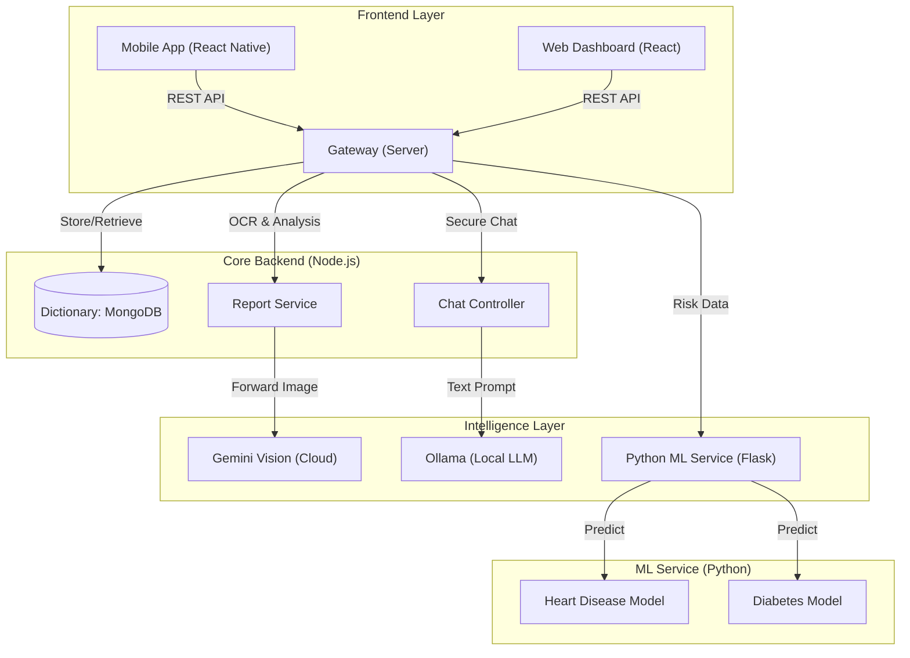

# Aether Clinic: AI-Powered Healthcare System

A comprehensive, privacy-first healthcare platform integrating React Native Mobile, Modern Web Clients, Node.js Backend, and Python ML Services.

## Detailed System Workflows

---

## High-Level Architecture

The system operates on a microservices-inspired architecture where the backend orchestrates communication between the user interfaces (Mobile/Web) and the specialized Intelligence Layer (Machine Learning & LLMs).

---

## Key System Components

### Mobile App
- **Technologies**: React Native, Expo, Reanimated
- **Description**: Patient-facing app providing a secure interface for health monitoring, AI-driven consultation, and medical report digitization.

### Web Client
- **Technologies**: React, Vite, TailwindCSS
- **Description**: Clinical dashboard for healthcare providers to review patient analytics, manage clinic data, and oversee health trends.

### Backend API
- **Technologies**: Node.js, Express, MongoDB
- **Description**: Central orchestration layer managing authentication, data security, and communication between AI services and frontend clients.

### ML Engine
- **Technologies**: Python, Flask, Scikit-Learn
- **Description**: High-fidelity predictive engine for specialized health risk assessment, specifically for heart disease and diabetes.

### LLM Service
- **Technologies**: Google Gemini, Ollama
- **Description**: Hybrid intelligence model utilizing cloud-based Vision for complex diagnostic analysis and local LLMs for private, secure consultations.

### Infrastructure
- **Technologies**: Kubernetes, Docker
- **Description**: Scalable, containerized infrastructure designed for high availability and resilient data management.

---

## Security & Privacy Architecture

Aether Clinic prioritizes user data privacy through a "Local-First" intelligence approach and rigorous encryption standards.

- **Zero-Knowledge Architecture**: Routine consultations are handled by local LLMs to ensure that sensitive health data never leaves the secure server infrastructure.
- **Data Encryption**: All medical reports and analytical results are encrypted using AES-256 before being stored in the database.
- **Ephemeral Image Processing**: Images analyzed by vision services are processed in-memory and are not persisted on cloud storage.

---

## Repository Structure

- **/mobile**: Patient application source code.
- **/client**: Clinical dashboard source code.
- **/server**: Node.js backend and API infrastructure.
- **/ml**: Python-based machine learning service.
- **/k8s**: Deployment manifests for Kubernetes.

---
*Building for the future of healthcare.*
