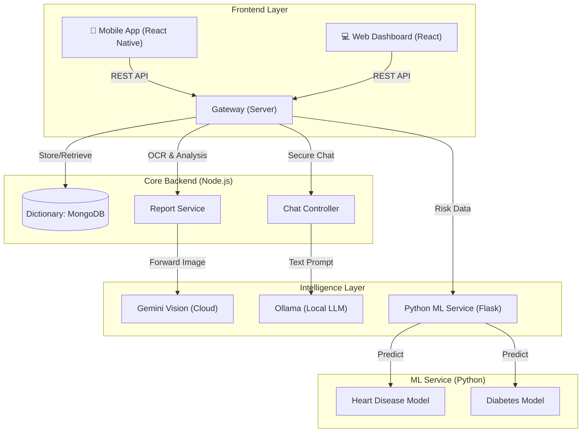
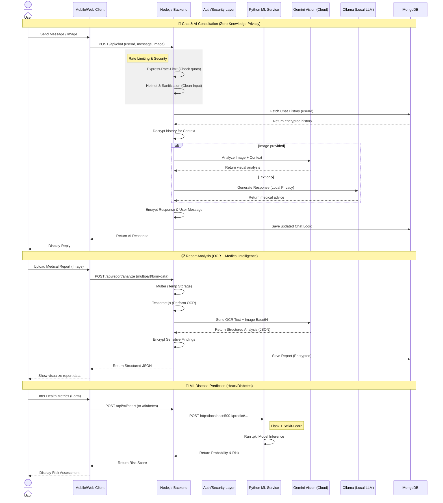

# 🏥 Aether Clinic: AI-Powered Healthcare System

**A comprehensive, privacy-first healthcare platform integrating React Native Mobile, Modern Web Clients, Node.js Backend, and Python ML Services.**

---

## 🏗️ High-Level Architecture

The system operates on a microservices-inspired architecture where the backend orchestrates communication between the user interfaces (Mobile/Web) and the specialized Intelligence Layer (Machine Learning & LLMs).

---

## 🔄 Detailed System Workflows

---

## 🚀 Key System Components

| Component | Tech Stack | Role & Functionality |
| :--- | :--- | :--- |
| **Mobile App** | React Native, Expo, Reanimated | Patient-facing app. Features "Aether" UI, biometric security, real-time chat, and report scanning. |
| **Web Client** | React, Vite, TailwindCSS | Doctor/Admin dashboard. Visualizes patient trends, displays aggregated risk profiles, and manages clinics. |
| **Backend API** | Node.js, Express, MongoDB | The central nervous system. Handles auth, data persistence, and orchestrates AI requests. |
| **ML Engine** | Python, Flask, Scikit-Learn | Specialized service for numerical health predictions (Heart Disease, Diabetes). |
| **LLM Service** | Google Gemini + Ollama | Hybrid Intelligence. Uses Cloud Gemini for complex vision tasks and Local Ollama for privacy-focused chat. |
| **Infrastructure** | Kubernetes, Docker | Containerized deployment strategies for scalability and resilience. |

---

## 🔐 Security & Privacy Architecture

The system prioritizes user data privacy through a "Local-First" intelligence approach and rigorous encryption standards.

*   **Zero-Knowledge Chat**: Routine conversations are processed via **Local Ollama**, ensuring chats don't leave the server infrastructure.
*   **Encrypted Storage**: Medical reports and analysis results are encrypted before storage in MongoDB.
*   **Ephemeral processing**: Images sent to Cloud Vision are processed in memory and not permanently stored on external servers.

---

## 📂 Repository Structure

*   **/mobile**: The React Native application source code.
*   **/client**: The Web Dashboard source code.
*   **/server**: The Node.js Express backend and API routes.
*   **/ml**: The Python Flask service serving the trained `.pkl` models.
*   **/k8s**: Kubernetes manifests for deployment.

---
*Built with ❤️ for the Future of Healthcare.*
