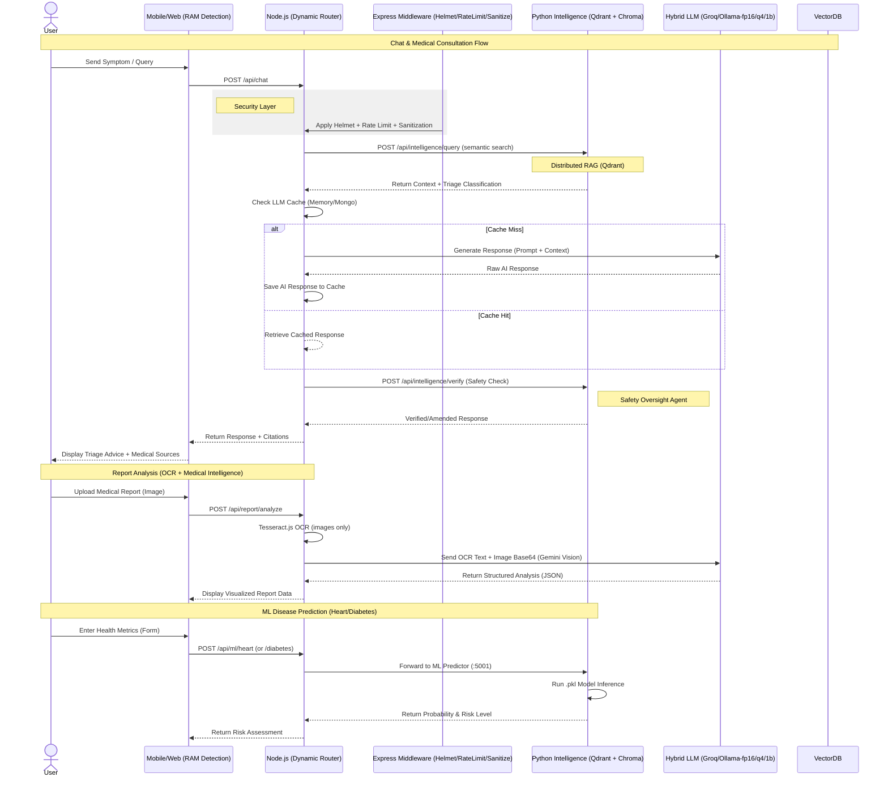
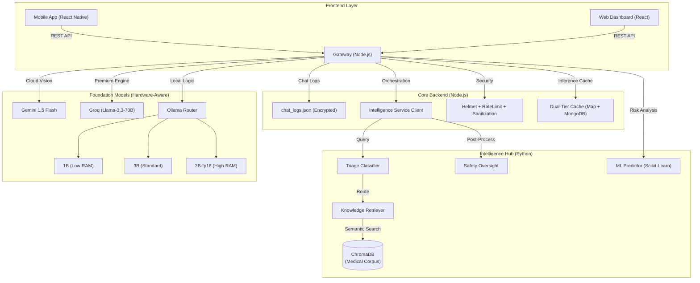
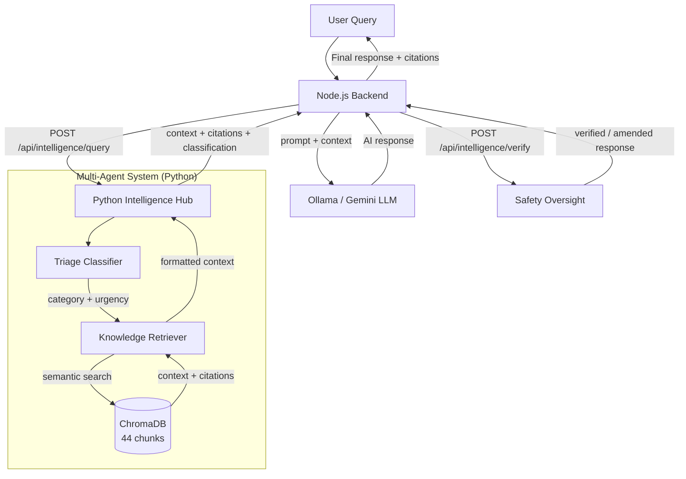
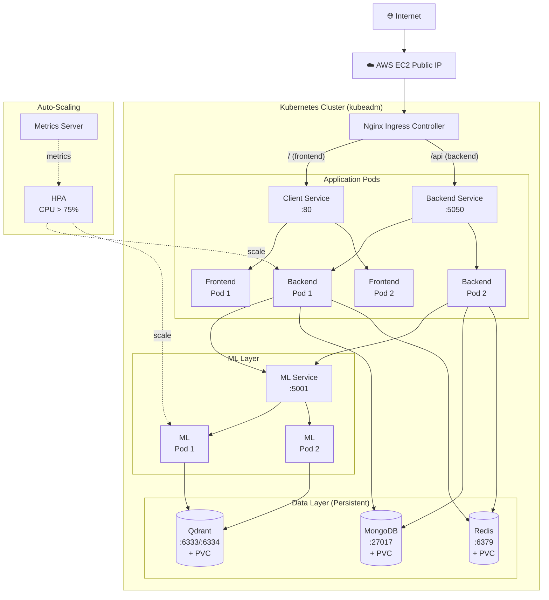
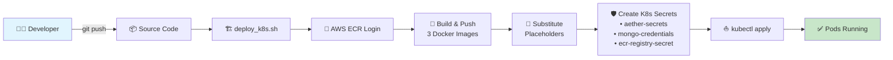
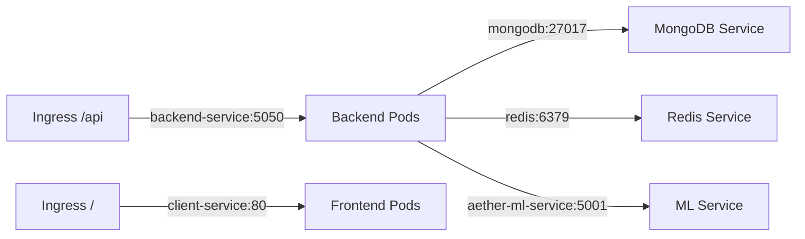

# MedNexus: AI-Powered Healthcare System

A comprehensive, privacy-first healthcare platform integrating React Native Mobile, Modern Web Clients, Node.js Backend, and Python ML Services — deployable locally via Docker Compose or at scale on Kubernetes (AWS ECR + kubeadm).

---

## Table of Contents
- [📸 Screenshots & Demo](#-screenshots--demo)
- [System Workflows](#detailed-system-workflows)
- [High-Level Architecture](#high-level-architecture)
- [Intelligence Hub (Multi-Agent RAG)](#intelligence-hub-multi-agent-rag)
- [Advanced Scaling & Hardware-Aware AI](#advanced-scaling--hardware-aware-ai-)
- [Kubernetes Deployment](#kubernetes-deployment-)
- [Key System Components](#key-system-components)
- [Security & Privacy Architecture](#security--privacy-architecture)
- [Repository Structure](#repository-structure)

---

## 📸 Screenshots & Demo


---

## Detailed System Workflows



---

## High-Level Architecture

The system operates on a multi-agent microservices architecture where the Node.js backend acts as the orchestrator between user clients and a specialized Python Intelligence Hub.



---

## Intelligence Hub (Multi-Agent RAG)

### Architecture Overview
The Multi-Agent RAG system uses semantic search and specialized agents to provide accurate, cited medical guidance.

**Technologies**: Python, Flask, LangGraph, ChromaDB, Sentence-Transformers

**Agentic Framework**:
- **Triage Classifier**: Categorizes queries and detects emergency urgency levels.
- **Knowledge Retriever**: Performs hybrid semantic search against a Vector DB (ChromaDB) containing 44+ medical knowledge chunks.
- **Safety Oversight**: Post-processes AI responses to detect hallucinations and ensure mandatory safety warnings are present.

### Internal Agent Workflow
The following diagram illustrates the internal decision-making and data retrieval flow within the Intelligence Hub.




---

## Advanced Scaling & Hardware-Aware AI 🧠🚀

To ensure production-grade reliability and cost-efficiency, MedNexus implements a **Four-Layer Model Infrastructure** that dynamically adapts to the user's hardware and subscription status.

### 1. Dynamic Quantization Strategy (Hardware-Aware)
The system uses the `navigator.deviceMemory` API to detect available RAM and automatically routes to the most efficient quantization level:

| Layer | RAM Threshold | Model Used | Performance Profile |
| :--- | :--- | :--- | :--- |
| **Layer 1: Ultra-Light** | < 4GB | `llama3.2:1b` | Optimized for low-end mobile/laptop devices |
| **Layer 2: Balanced** | 4GB - 16GB | `llama3.2` | Standard 3B model for smooth real-time chat |
| **Layer 3: Professional** | > 16GB | `llama3.2:3b-fp16` | Full-precision 16-bit model for maximum accuracy |
| **Layer 4: Premium** | MedNexus+ Tier | `llama-3.3-70b` | High-performance Groq Cloud (450+ tokens/sec) |

### 2. Distributed RAG Scalability (Qdrant + ChromaDB)
We transitioned from a local-only vector store to a **Hybrid Distributed Architecture** designed to handle millions of medical research papers:

- **Primary Cluster (Qdrant)**: A cloud-ready, distributed vector database used for high-throughput, low-latency semantic search across clusters.
- **Edge Fallback (ChromaDB)**: A local persistent client remains in the stack to provide "Offline-First" resiliency if the Qdrant cluster is unreachable.
- **Auto-Sync Logic**: The Python ML Hub includes a "Cold-Start" sync mechanism that automatically migrates local medical protocols into the Qdrant cluster during the initial system boot.

### 3. Dual-Tier Inference Caching
To dramatically reduce API costs and latency for redundant queries, the Node.js API Gateway utilizes a structured dual-tier LLM caching system:
- **L1 Memory Cache**: Instant retrieval of repeat queries using a Node.js in-memory Map.
- **L2 MongoDB Cache**: Persistent cluster-level caching wrapper. The system automatically syncs L2 cache hits back to L1 for faster subsequent reads.

---

### Implementation Details

#### New Files (Python ML Service)
| File | Purpose |
|:-----|:--------|
| ingestion_service.py | Reads corpus, chunks, generates embeddings, and stores in ChromaDB |
| agents/init.py | Package initialization |
| agents/triage_classifier.py | Routes queries by medical category and urgency |
| agents/knowledge_retriever.py | Semantic search and hybrid retrieval |
| agents/safety_oversight.py | Final verification of AI response safety |
| data/medical_corpus/*.txt | Clinical guidelines for Cardiology, Endocrinology, General Medicine, Orthopedics, Pulmonology, and Mental Health |

#### Modified Files (Node.js Backend)
| File | Change |
|:-----|:--------|
| ragService.js | Rewritten as Intelligence Hub client with fallback capability |
| chatController.js | Integrated async intelligence retrieval and safety verification |
| mlRoutes.js | Added intelligence status monitor endpoint |

#### API Endpoints
| Method | Endpoint | Service | Description |
|:-------|:---------|:--------|:------------|
| POST | /api/intelligence/query | Python :5001 | Multi-agent RAG workflow |
| POST | /api/intelligence/verify | Python :5001 | Safety oversight verification |
| GET | /api/intelligence/status | Python :5001 | System health dashboard |
| GET | /api/ml/intelligence/status | Node :5050 | Proxied status check |

### Ingestion Statistics
- **6 Corpus Files**: Covering 9 medical specializations.
- **17 Medical Protocols**: Sourced from WHO, AHA, ADA, GINA, APA, NICE, CDC, and others.
- **44 Indexed Chunks**: High-dimensionality semantic embeddings.
- **Embedding Model**: all-MiniLM-L6-v2 (384 dimensions).

### Workflow: How to Run (Local Development)
```bash
# 1. Ingest medical knowledge (one-time or when adding new protocols)
cd ml && python3 ingestion_service.py

# 2. Start the ML + Intelligence Hub service
cd ml && python3 app.py

# 3. Start the Node.js backend (auto-connects to Intelligence Hub)
cd server && npm run dev
```

> [!NOTE]
> If the Intelligence Hub is unavailable, the system gracefully falls back to the legacy keyword-based retrieval system for maximum reliability.

### Docker Compose (Single-Machine Deployment)
For a quick all-in-one deployment without Kubernetes:
```bash
# Set required environment variables
export GEMINI_API_KEY="your-key"
export ENCRYPTION_KEY=$(node -e "console.log(require('crypto').randomBytes(32).toString('hex'))")
export PUBLIC_IP="your-server-ip"

# Launch all services
docker compose up -d --build
```

This starts MongoDB, Qdrant, ML Service, Backend, and Frontend in a single bridge network.

---

## Kubernetes Deployment ☸️

MedNexus supports production-grade deployment on a Kubernetes cluster with AWS ECR as the container registry. The deployment is fully automated via a single shell script.

### Cluster Architecture



### Deployment Pipeline



### Prerequisites

| Requirement | Details |
|:---|:---|
| **Kubernetes Cluster** | kubeadm (v1.28+), single or multi-node |
| **Container Registry** | AWS ECR (3 repos auto-created by script) |
| **Ingress Controller** | NGINX Ingress (`ingress-nginx`) |
| **Metrics Server** | Required for HPA auto-scaling |
| **Storage Provisioner** | Default StorageClass (e.g., `local-path-provisioner` for single-node) |
| **CLI Tools** | `kubectl`, `aws` CLI, `docker`, `openssl` |

### Manifest Overview

| Manifest | Resource | Replicas | Persistence |
|:---|:---|:---|:---|
| `backend-deployment.yaml` | Backend API (Node.js) | 2 (HPA: 2→10) | Shared volume (`hostPath`) |
| `client-deployment.yaml` | Web Frontend (Nginx) | 2 | — |
| `ml-deployment.yaml` | ML Intelligence Hub (Python) | 2 (HPA: 2→5) | Shared volume (`hostPath`) |
| `ml-job.yaml` | One-shot ML training Job | 1 | — |
| `mongo-deployment.yaml` | MongoDB | 1 | 5Gi PVC |
| `qdrant-deployment.yaml` | Qdrant Vector DB | 1 | 5Gi PVC |
| `redis-deployment.yaml` | Redis Cache | 1 | 1Gi PVC (AOF enabled) |
| `ingress.yaml` | NGINX Ingress routes | — | — |
| `hpa.yaml` | Autoscalers (CPU 75%) | — | — |

### Service Wiring

Internal DNS resolution connects all services within the cluster:



### Secrets Management

The deploy script automatically creates three Kubernetes secrets:

| Secret | Keys | Source |
|:---|:---|:---|
| `aether-secrets` | `gemini-api-key`, `encryption-key` | User prompt + auto-generated |
| `mongo-credentials` | `username`, `password` | Auto-generated (printed to terminal) |
| `ecr-registry-secret` | Docker registry auth | AWS ECR login token |

### Quick Deploy

```bash
# 1. Clone the repo on your EC2/k8s node
git clone https://github.com/your-org/ai-doctor-final.git
cd ai-doctor-final

# 2. Run the automated deployment pipeline
bash scripts/deploy_k8s.sh
# → Prompts for: AWS Account ID, AWS Region, Gemini API Key

# 3. Monitor rollout
kubectl get pods -w
kubectl get ingress
```

> [!IMPORTANT]
> Before running the deploy script, ensure your cluster has:
> - NGINX Ingress Controller: `kubectl get pods -n ingress-nginx`
> - Metrics Server: `kubectl get pods -n kube-system | grep metrics`
> - Default StorageClass: `kubectl get storageclass`

> [!TIP]
> For a single-node kubeadm cluster without a CSI driver, install the local-path-provisioner:
> ```bash
> kubectl apply -f https://raw.githubusercontent.com/rancher/local-path-provisioner/v0.0.30/deploy/local-path-storage.yaml
> kubectl patch storageclass local-path -p '{"metadata":{"annotations":{"storageclass.kubernetes.io/is-default-class":"true"}}}'
> ```

### Post-Deployment Verification

```bash
# Check all pods are running
kubectl get pods

# Verify ingress is routing
kubectl get ingress aether-ingress

# Test backend health
curl http://<NODE_IP>/api/health

# Check HPA status
kubectl get hpa
```

---

## Key System Components

### Mobile App
- **Technologies**: React Native, Expo, Reanimated
- **Description**: Patient-facing app for health monitoring, AI consultation, and report digitization.

### Web Client
- **Technologies**: React, Vite, TailwindCSS, TypeScript
- **Description**: Clinical dashboard for healthcare providers to review patient analytics and management.

### Backend API (Gateway)
- **Technologies**: Node.js, Express, MongoDB, Redis
- **Description**: Orchestration layer for security, OCR processing, caching, and agentic communication.

### ML Intelligence Hub
- **Technologies**: Python, Flask, Scikit-Learn, LangGraph, Sentence-Transformers
- **Description**: Multi-agent RAG system with triage, knowledge retrieval, safety oversight, and risk prediction for heart disease and diabetes.

### Data Layer
- **MongoDB**: Primary data store for user records, chat history, and inference cache (L2).
- **Qdrant**: Distributed vector database for high-throughput semantic search across medical knowledge.
- **Redis**: In-cluster cache with AOF persistence for session data and hot-path caching.

---

## Security & Privacy Architecture
- **Zero-Knowledge Intelligence**: Local LLM processing (Ollama) for routine consultations.
- **AES-256 Encryption**: Hardware-isolated encryption for all sensitive communication logs.
- **Agentic Safety Guardrails**: Real-time cross-referencing against clinical guidelines to prevent dangerous recommendations.
- **MongoDB Authentication**: Root credentials managed via Kubernetes Secrets — no default open access.
- **Network Isolation**: All inter-service communication happens over ClusterIP (not exposed externally).

---

## Repository Structure
```
ai-doctor-final/
├── client/                  # Web Dashboard (React + Vite + TailwindCSS)
│   ├── src/                 # React components, pages, hooks
│   ├── Dockerfile           # Nginx-based production container
│   └── nginx.conf           # Frontend reverse proxy config
├── mobile/                  # Patient App (React Native + Expo)
├── server/                  # Backend API Gateway (Node.js + Express)
│   ├── controllers/         # Route handlers (chat, report, ML proxy)
│   ├── services/            # Business logic (RAG, cache, intelligence)
│   ├── utils/               # Helpers (encryption, cache manager)
│   ├── routes/              # Express route definitions
│   ├── models/              # Mongoose schemas
│   └── Dockerfile           # Node.js production container
├── ml/                      # ML Intelligence Hub (Python + Flask)
│   ├── agents/              # Triage, Retrieval, Safety agent source code
│   ├── data/medical_corpus/ # Source clinical guidelines for RAG
│   ├── models/              # Pre-trained .pkl models (heart, diabetes)
│   ├── ingestion_service.py # Corpus → ChromaDB ingestion pipeline
│   ├── app.py               # Flask app entry point
│   └── Dockerfile           # Python production container
├── k8s/                     # Kubernetes manifests
│   ├── backend-deployment.yaml
│   ├── client-deployment.yaml
│   ├── ml-deployment.yaml
│   ├── ml-service.yaml
│   ├── ml-job.yaml
│   ├── mongo-deployment.yaml
│   ├── qdrant-deployment.yaml
│   ├── redis-deployment.yaml
│   ├── ingress.yaml
│   └── hpa.yaml
├── scripts/                 # Automation scripts
│   └── deploy_k8s.sh        # One-command K8s deployment pipeline
├── docker-compose.yml       # Local/single-machine deployment
├── security.md              # Security architecture documentation
└── README.md                # ← You are here
```

---

*Building for a safer, smarter future of healthcare.* ☸️🏥

