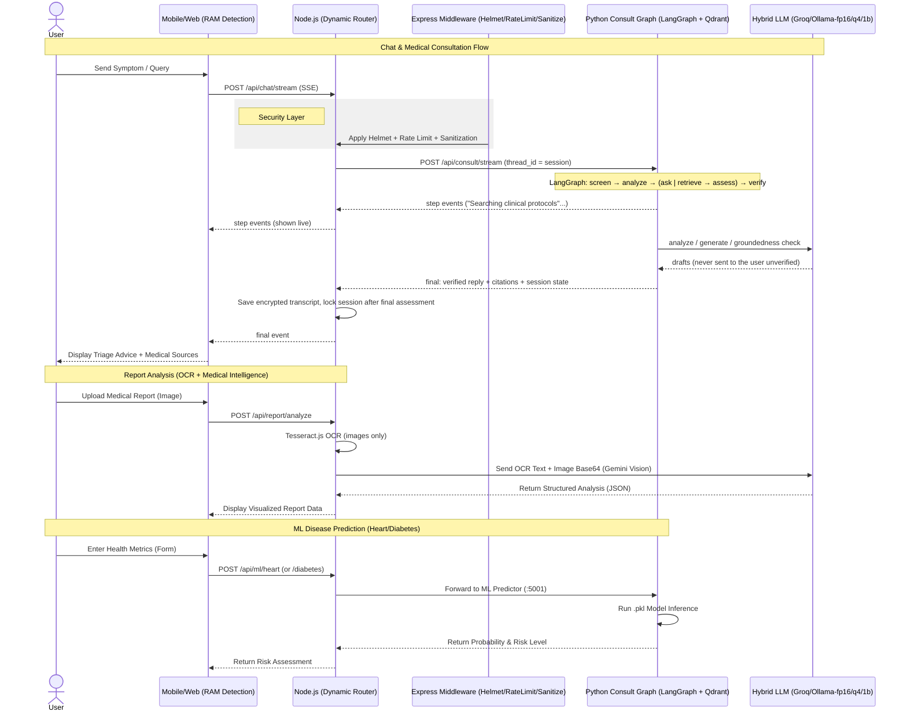
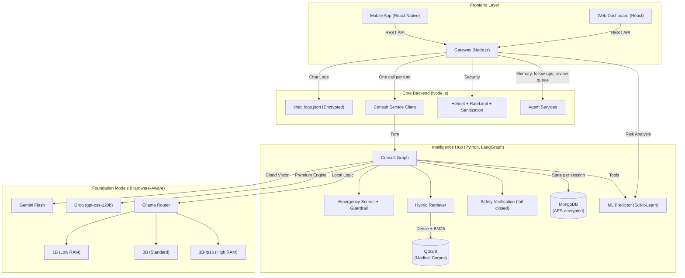
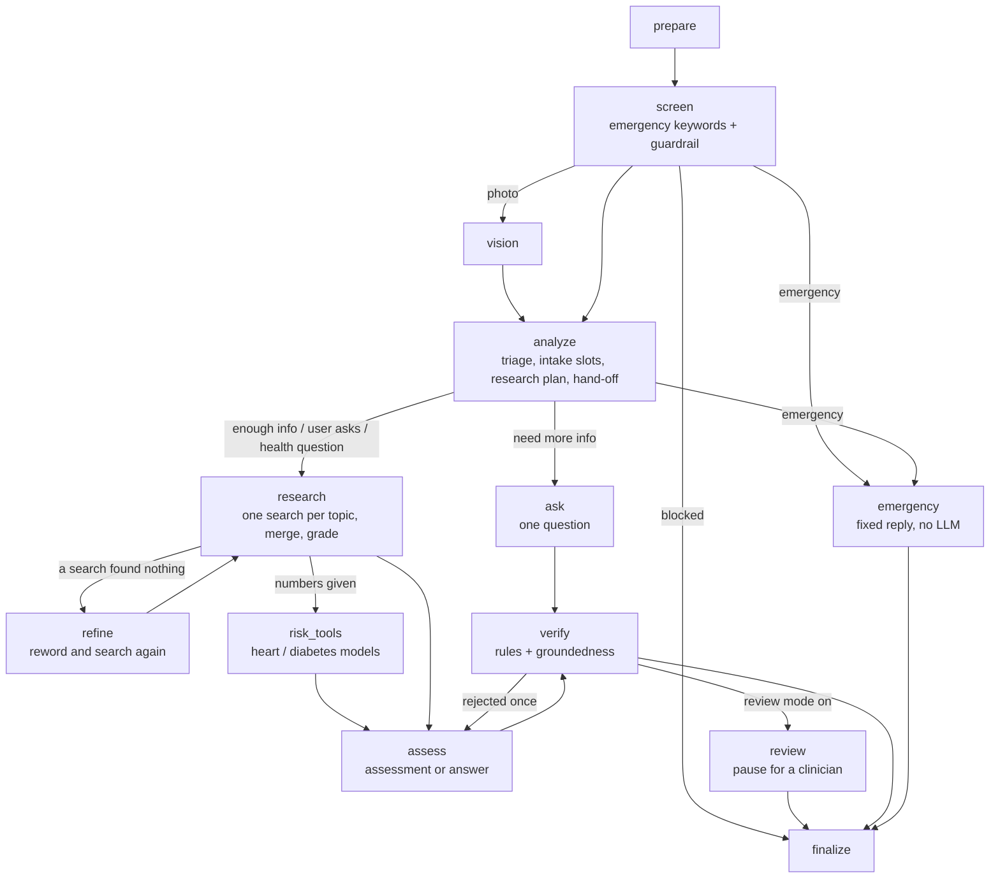
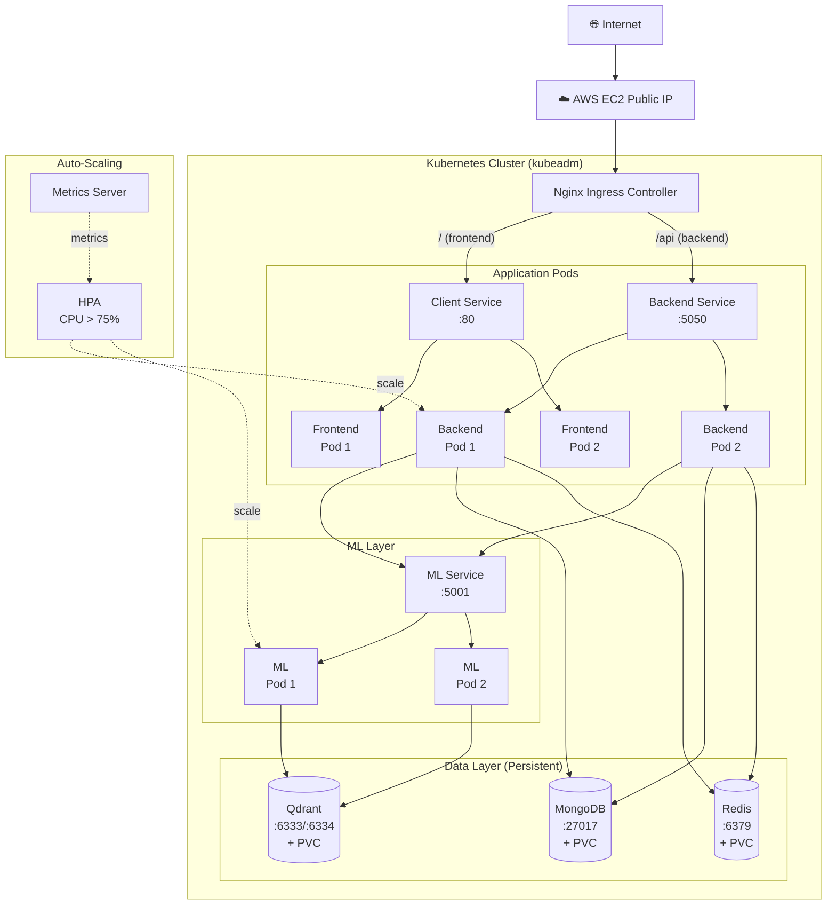
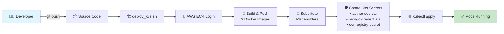
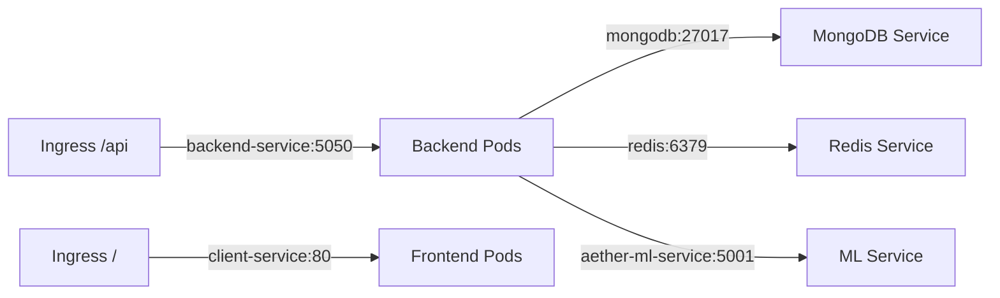

# MedNexus: AI-Powered Healthcare System

A comprehensive, privacy-first healthcare platform integrating React Native Mobile, Modern Web Clients, Node.js Backend, and Python ML Services — deployable locally via Docker Compose or at scale on Kubernetes (AWS ECR + kubeadm).

---

## Table of Contents
- [📸 Screenshots & Demo](#-screenshots--demo)
- [System Workflows](#detailed-system-workflows)
- [High-Level Architecture](#high-level-architecture)
- [Intelligence Hub (LangGraph Consultation Flow)](#intelligence-hub-langgraph-consultation-flow)
- [Advanced Scaling & Hardware-Aware AI](#advanced-scaling--hardware-aware-ai-)
- [Kubernetes Deployment](#kubernetes-deployment-)
- [Key System Components](#key-system-components)
- [Security & Privacy Architecture](#security--privacy-architecture)
- [Repository Structure](#repository-structure)

---

## 📸 Screenshots & Demo

| **Neural Consultation Interface** | **Cardiac Risk Analyzer** |
| :---: | :---: |
|  |  |
| *AI Medical Triage & Consultation* | *Deep Learning Cardiac Biometric Scanning* |

| **Diabetes Risk Analyzer** | **Medical OCR & Report Analysis** |
| :---: | :---: |
|  |  |
| *Predictive Diabetes Risk Analytics* | *Automatic OCR Extraction & Lab Report Summarization* |

---

## Detailed System Workflows


```mermaid
sequenceDiagram
    actor User
    participant App as Mobile/Web (RAM Detection)
    participant Server as Node.js (Dynamic Router)
    participant Security as Express Middleware (Helmet/RateLimit/Sanitize)
    participant IntelHub as Python Consult Graph (LangGraph + Qdrant)
    participant LLM as Hybrid LLM (Groq/Ollama-fp16/q4/1b)
    
    Note over User,LLM: Chat & Medical Consultation Flow
    User->>App: Send Symptom / Query
    App->>Server: POST /api/chat/stream (SSE)

    rect rgb(240, 240, 240)
        Note left of Server: Security Layer
        Security->>Server: Apply Helmet + Rate Limit + Sanitization
    end

    Server->>IntelHub: POST /api/consult/stream (thread_id = session)
    Note over IntelHub: LangGraph: screen → analyze → (ask | retrieve → assess) → verify
    IntelHub-->>Server: step events ("Searching clinical protocols"...)
    Server-->>App: step events (shown live)
    IntelHub->>LLM: analyze / generate / groundedness check
    LLM-->>IntelHub: drafts (never sent to the user unverified)
    IntelHub-->>Server: final: verified reply + citations + session state
    Server->>Server: Save encrypted transcript, lock session after final assessment
    Server-->>App: final event
    App-->>User: Display Triage Advice + Medical Sources

    Note over User,Server: Report Analysis (OCR + Medical Intelligence)
    User->>App: Upload Medical Report (Image)
    App->>Server: POST /api/report/analyze
    
    Server->>Server: Tesseract.js OCR (images only)
    Server->>LLM: Send OCR Text + Image Base64 (Gemini Vision)
    LLM-->>Server: Return Structured Analysis (JSON)
    Server-->>App: Display Visualized Report Data

    Note over User,IntelHub: ML Disease Prediction (Heart/Diabetes)
    User->>App: Enter Health Metrics (Form)
    App->>Server: POST /api/ml/heart (or /diabetes)
    Server->>IntelHub: Forward to ML Predictor (:5001)
    IntelHub->>IntelHub: Run .pkl Model Inference
    IntelHub-->>Server: Return Probability & Risk Level
    Server-->>App: Return Risk Assessment
```

---

## High-Level Architecture

The system is a set of microservices. The Node.js backend is the gateway for user clients (security, uploads, encrypted transcripts). The Python Intelligence Hub runs the consultation itself as a LangGraph state machine, and serves the risk models.


```mermaid
graph TD
    subgraph "Frontend Layer"
        M["Mobile App (React Native)"] -->|REST API| G["Gateway (Node.js)"]
        W["Web Dashboard (React)"] -->|REST API| G
    end

    subgraph "Core Backend (Node.js)"
        G -->|Chat Logs| F["chat_logs.json (Encrypted)"]
        G -->|One call per turn| S["Consult Service Client"]
        G -->|Security| X["Helmet + RateLimit + Sanitization"]
        G -->|Memory, follow-ups, review queue| C["Agent Services"]
    end

    subgraph "Intelligence Hub (Python, LangGraph)"
        S -->|Turn| CG["Consult Graph"]
        CG --> ES["Emergency Screen + Guardrail"]
        CG --> KR["Hybrid Retriever"]
        KR -->|Dense + BM25| CDB[("Qdrant\n(Medical Corpus)")]
        CG --> SO["Safety Verification (fail-closed)"]
        CG -->|State per session| CK[("MongoDB\n(AES-encrypted)")]
        CG -->|Tools| ML["ML Predictor (Scikit-Learn)"]
        G -->|Risk Analysis| ML
    end

    subgraph "Foundation Models (Hardware-Aware)"
        CG -->|Cloud Vision| V["Gemini Flash"]
        CG -->|Premium Engine| GR["Groq (gpt-oss-120b)"]
        CG -->|Local Logic| L["Ollama Router"]
        L --> Q1["1B (Low RAM)"]
        L --> Q2["3B (Standard)"]
        L --> Q3["3B-fp16 (High RAM)"]
    end
```

---

## Intelligence Hub (LangGraph Consultation Flow)

### Architecture Overview
One chat turn is one run of a **LangGraph state machine** in the Python service. The Node.js backend is a thin gateway: it validates the request, forwards it, stores the encrypted transcript and relays progress to the browser.

**Technologies**: Python, Flask, LangGraph, Qdrant, Sentence-Transformers


```mermaid
graph TD
    P["prepare"] --> S["screen<br/>emergency keywords + guardrail"]
    S -->|emergency| E["emergency<br/>fixed reply, no LLM"]
    S -->|blocked| F["finalize"]
    S -->|photo| V["vision"] --> A
    S --> A["analyze<br/>triage, intake slots, research plan, hand-off"]
    A -->|emergency| E
    A -->|need more info| Q["ask<br/>one question"]
    A -->|enough info / user asks / health question| R["research<br/>one search per topic, merge, grade"]
    R -->|a search found nothing| RF["refine<br/>reword and search again"] --> R
    R -->|numbers given| T["risk_tools<br/>heart / diabetes models"] --> W
    R --> W["assess<br/>assessment or answer"]
    Q --> Y["verify<br/>rules + groundedness"]
    W --> Y
    Y -->|rejected once| W
    Y -->|review mode on| H["review<br/>pause for a clinician"] --> F
    Y --> F
    E --> F
```

**What each step does**:
- **Emergency screen**: a keyword layer with negation handling that runs before any model. A hit returns a fixed, reviewed message with emergency numbers. Self-harm always gets the crisis reply.
- **Analyze**: one structured-output call fills the intake slots (complaint, location, duration, severity, character, triggers, associated symptoms, history) and writes the research plan. Slot values the user never said are dropped. Rules take over if no model answers.
- **Ask / assess decision**: made from the slots, not from a turn counter. The user can ask for the assessment at any time; a cap of 6 turns is the safety net.
- **Research agent**: plans one search per distinct problem, runs them against Qdrant (dense embeddings plus BM25), rewords a search that found nothing and tries once more, then merges so each topic keeps its best match. Results are graded `strong` / `weak` / `none`; off-topic context is never used or cited.
- **Risk tools**: the heart and diabetes models are callable tools. A value the user did not state, or one outside the training range, is rejected instead of scored.
- **Verify**: rule checks always run and fail closed. For hosted models a second call checks that clinical claims are backed by the retrieved protocols. A rejected draft is regenerated once.
- **Review** (optional): with `REVIEW_MODE` on, the graph pauses and a clinician approves, edits or rejects the assessment before the user sees it.
- **State**: saved per session by a LangGraph checkpointer in MongoDB, AES-encrypted, one record per conversation, 30-day expiry.

### Agentic features around the chat

| Feature | What it does |
|:--|:--|
| **Research agent** | Plan → search → check → refine loop for the assessment. On two-topic messages it found both protocols 8 of 8 times, against 6 of 8 for a single search. |
| **Specialist hand-off** | Each category has a specialist profile. A heart-clinic chat about a knee injury is handed to the Bone Specialist, with a one-line note. |
| **Report agent** | Extracts lab values (vision model for photos), checks each against its range with a rule-based tool, explains, and offers a consultation about the out-of-range values. |
| **Patient memory** | A short encrypted summary of each finished consultation is used as background next time. Users can switch it off and delete it in Settings. |
| **Follow-up agent** | Opt-in check-in email two days after an assessment. "Worse" or "the same" opens a new consultation that starts from the earlier complaint. |
| **Clinician review** | Human in the loop: LangGraph `interrupt()` pauses the run, a clinician decides at `/review`, the run resumes. Off by default. |

Full details, measured retrieval numbers and configuration: [docs/ARCHITECTURE.md](docs/ARCHITECTURE.md).

---

## Advanced Scaling & Hardware-Aware AI 🧠🚀

To ensure production-grade reliability and cost-efficiency, MedNexus implements a **Four-Layer Model Infrastructure** that dynamically adapts to the user's hardware and subscription status.

### 1. Dynamic Quantization Strategy (Hardware-Aware)
The system uses the `navigator.deviceMemory` API to detect available RAM and automatically routes to the most efficient quantization level:

| Layer | RAM Threshold | Model Used | Performance Profile |
| :--- | :--- | :--- | :--- |
| **Layer 1: Ultra-Light** | < 4GB | `llama3.2:1b` | Optimized for low-end mobile/laptop devices |
| **Layer 2: Balanced** | 4GB - 16GB | `llama3.2` | Standard 3B model for smooth real-time chat |
| **Layer 3: Professional** | > 16GB | `llama3.2:3b-fp16` | Full-precision 16-bit model for maximum accuracy |
| **Layer 4: Premium** | MedNexus+ Tier | `openai/gpt-oss-120b` (set `GROQ_MODEL` to change) | High-performance Groq Cloud |

### 2. One Vector Store (Qdrant)
- **Server mode** (Docker Compose, Kubernetes): set `QDRANT_HOST` or `QDRANT_URL`. Each chunk has a dense vector and a BM25 sparse vector; ingestion is idempotent (`python -m retrieval.ingest`).
- **Embedded mode** (local dev, single-container hosts): with no Qdrant configured, the same code builds an in-memory index from the corpus at startup. There is no second database to keep in sync.

### 3. No Reply Caching
Chat replies and report analyses are **not** cached: both depend on the user's own data and on the conversation state, so a cached answer would be wrong for the next person. (`server/utils/cacheManager.js` is left over from the earlier design and is no longer on any request path.)

---

### Implementation Details

#### API Endpoints
| Method | Endpoint | Service | Description |
|:-------|:---------|:--------|:------------|
| POST | /api/chat | Node :5050 | One chat turn (JSON response) |
| POST | /api/chat/stream | Node :5050 | One chat turn as server-sent events: `step` events, then `final` |
| POST | /api/consult | Python :5001 | Runs the consultation graph for one turn |
| POST | /api/consult/stream | Python :5001 | Same, streamed |
| DELETE | /api/consult/thread/:id | Python :5001 | Deletes one conversation's saved state |
| POST | /api/intelligence/query | Python :5001 | Retrieval only (guardrail → hybrid search) |
| POST | /api/intelligence/verify | Python :5001 | Rule-based safety check for a text |
| POST | /api/consult/review/:id | Python :5001 | Resumes a paused consultation with a clinician's decision |
| GET | /api/consult/reviews | Python :5001 | Assessments waiting for a clinician |
| POST | /api/report/analyze | Python :5001 | Report agent (extract → range check → explain → verify) |
| GET, DELETE | /api/chat/memory/:userId | Node :5050 | View or delete the saved consultation summaries |
| GET, POST | /api/review, /api/review/:threadId | Node :5050 | Clinician review queue (needs `x-reviewer-key`) |
| POST | /api/followup | Node :5050 | Ask for a check-in after a finished consultation |
| GET, POST | /api/followup/:token, /api/followup/:token/respond | Node :5050 | The emailed check-in link and its answer |
| GET | /api/intelligence/status | Python :5001 | System health dashboard |
| GET | /api/ml/intelligence/status | Node :5050 | Proxied status check |

### Corpus
- **6 Corpus Files**: Covering 9 medical specializations.
- **17 Medical Protocols**: Sourced from WHO, AHA, ADA, GINA, APA, NICE, CDC, and others.
- **42 Indexed Chunks**, split on section boundaries.
- **Embedding Model**: all-MiniLM-L6-v2 (384 dimensions) + BM25 sparse vectors.

### Workflow: How to Run (Local Development)
```bash
# 1. Start the ML + Intelligence Hub service (builds its index at startup)
cd ml && source venv/bin/activate && pip install -r requirements.txt && python3 app.py

# 2. Start the Node.js backend
cd server && npm run dev

# Tests and offline evals
cd ml && python -m pytest tests -q && python -m evals.run_evals
cd server && npm test
```

> [!NOTE]
> If the Python service is unavailable, the chat returns a clear "temporarily unavailable" message. The gateway never writes a medical reply on its own.

### Docker Compose (Single-Machine Deployment)
For a quick all-in-one deployment without Kubernetes:
```bash
# Set required environment variables
export GEMINI_API_KEY="your-key"
export ENCRYPTION_KEY=$(node -e "console.log(require('crypto').randomBytes(32).toString('hex'))")
export PUBLIC_IP="your-server-ip"

# Launch all services
docker compose up -d --build
```

This starts MongoDB, Qdrant, ML Service, Backend, and Frontend in a single bridge network.

---

## Kubernetes Deployment ☸️

MedNexus supports production-grade deployment on a Kubernetes cluster with AWS ECR as the container registry. The deployment is fully automated via a single shell script.

### Cluster Architecture


```mermaid
graph TB
    Internet["🌐 Internet"] --> LB["☁️ AWS EC2 Public IP"]
    LB --> IC["Nginx Ingress Controller"]
    
    subgraph K8s["Kubernetes Cluster (kubeadm)"]
        IC -->|"/ (frontend)"| CS["Client Service\n:80"]
        IC -->|"/api (backend)"| BS["Backend Service\n:5050"]
        
        subgraph App["Application Pods"]
            CS --> CP1["Frontend\nPod 1"]
            CS --> CP2["Frontend\nPod 2"]
            BS --> BP1["Backend\nPod 1"]
            BS --> BP2["Backend\nPod 2"]
        end

        subgraph ML["ML Layer"]
            MLS["ML Service\n:5001"] --> MP1["ML\nPod 1"]
            MLS --> MP2["ML\nPod 2"]
        end

        subgraph Data["Data Layer (Persistent)"]
            MDB[("MongoDB\n:27017\n+ PVC")]
            QD[("Qdrant\n:6333/:6334\n+ PVC")]
            RD[("Redis\n:6379\n+ PVC")]
        end

        BP1 & BP2 --> MLS
        BP1 & BP2 --> MDB
        BP1 & BP2 --> RD
        MP1 & MP2 --> QD
    end

    subgraph Scaling["Auto-Scaling"]
        HPA["HPA\nCPU > 75%"] -.->|scale| BP1
        HPA -.->|scale| MP1
        MS["Metrics Server"] -.->|metrics| HPA
    end
```

### Deployment Pipeline


```mermaid
flowchart LR
    A["🧑‍💻 Developer"] -->|"git push"| B["📦 Source Code"]
    B --> C["🏗️ deploy_k8s.sh"]
    
    C --> D["🔐 AWS ECR Login"]
    D --> E["🐳 Build & Push\n3 Docker Images"]
    E --> F["📝 Substitute\nPlaceholders"]
    F --> G["🛡️ Create K8s Secrets\n• aether-secrets\n• mongo-credentials\n• ecr-registry-secret"]
    G --> H["⛵ kubectl apply"]
    H --> I["✅ Pods Running"]
    
    style A fill:#e1f5fe
    style I fill:#c8e6c9
```

### Prerequisites

| Requirement | Details |
|:---|:---|
| **Kubernetes Cluster** | kubeadm (v1.28+), single or multi-node |
| **Container Registry** | AWS ECR (3 repos auto-created by script) |
| **Ingress Controller** | NGINX Ingress (`ingress-nginx`) |
| **Metrics Server** | Required for HPA auto-scaling |
| **Storage Provisioner** | Default StorageClass (e.g., `local-path-provisioner` for single-node) |
| **CLI Tools** | `kubectl`, `aws` CLI, `docker`, `openssl` |

### Manifest Overview

| Manifest | Resource | Replicas | Persistence |
|:---|:---|:---|:---|
| `backend-deployment.yaml` | Backend API (Node.js) | 2 (HPA: 2→10) | Shared volume (`hostPath`) |
| `client-deployment.yaml` | Web Frontend (Nginx) | 2 | — |
| `ml-deployment.yaml` | ML Intelligence Hub (Python) | 2 (HPA: 2→5) | Shared volume (`hostPath`) |
| `ml-job.yaml` | One-shot ML training Job | 1 | — |
| `mongo-deployment.yaml` | MongoDB | 1 | 5Gi PVC |
| `qdrant-deployment.yaml` | Qdrant Vector DB | 1 | 5Gi PVC |
| `redis-deployment.yaml` | Redis Cache | 1 | 1Gi PVC (AOF enabled) |
| `ingress.yaml` | NGINX Ingress routes | — | — |
| `hpa.yaml` | Autoscalers (CPU 75%) | — | — |

### Service Wiring

Internal DNS resolution connects all services within the cluster:


```mermaid
graph LR
    BE["Backend Pods"] -->|"mongodb:27017"| MONGO["MongoDB Service"]
    BE -->|"redis:6379"| REDIS["Redis Service"]
    BE -->|"aether-ml-service:5001"| ML["ML Service"]
    
    ING["Ingress /api"] -->|"backend-service:5050"| BE
    ING2["Ingress /"] -->|"client-service:80"| FE["Frontend Pods"]
```

### Secrets Management

The deploy script automatically creates three Kubernetes secrets:

| Secret | Keys | Source |
|:---|:---|:---|
| `aether-secrets` | `gemini-api-key`, `encryption-key`, optional `groq-api-key` | User prompt + auto-generated |
| `mongo-credentials` | `username`, `password` | Auto-generated (printed to terminal) |
| `ecr-registry-secret` | Docker registry auth | AWS ECR login token |

### Quick Deploy

```bash
# 1. Clone the repo on your EC2/k8s node
git clone https://github.com/your-org/ai-doctor-final.git
cd ai-doctor-final

# 2. Run the automated deployment pipeline
bash scripts/deploy_k8s.sh
# → Prompts for: AWS Account ID, AWS Region, Gemini API Key

# 3. Monitor rollout
kubectl get pods -w
kubectl get ingress
```

> [!IMPORTANT]
> Before running the deploy script, ensure your cluster has:
> - NGINX Ingress Controller: `kubectl get pods -n ingress-nginx`
> - Metrics Server: `kubectl get pods -n kube-system | grep metrics`
> - Default StorageClass: `kubectl get storageclass`

> [!TIP]
> For a single-node kubeadm cluster without a CSI driver, install the local-path-provisioner:
> ```bash
> kubectl apply -f https://raw.githubusercontent.com/rancher/local-path-provisioner/v0.0.30/deploy/local-path-storage.yaml
> kubectl patch storageclass local-path -p '{"metadata":{"annotations":{"storageclass.kubernetes.io/is-default-class":"true"}}}'
> ```

### Post-Deployment Verification

```bash
# Check all pods are running
kubectl get pods

# Verify ingress is routing
kubectl get ingress aether-ingress

# Test backend health
curl http://<NODE_IP>/api/health

# Check HPA status
kubectl get hpa
```

---

## Key System Components

### Mobile App
- **Technologies**: React Native, Expo, Reanimated
- **Description**: Patient-facing app for health monitoring, AI consultation, and report digitization.

### Web Client
- **Technologies**: React, Vite, TailwindCSS, TypeScript
- **Description**: Clinical dashboard for healthcare providers to review patient analytics and management.

### Backend API (Gateway)
- **Technologies**: Node.js, Express, MongoDB, Redis
- **Description**: Gateway for security, OCR processing, caching, encrypted chat transcripts and streaming. It forwards each chat turn to the Python service and never writes a medical reply itself.

### ML Intelligence Hub
- **Technologies**: Python, Flask, Scikit-Learn, LangGraph, Sentence-Transformers
- **Description**: LangGraph consultation flow (emergency screen, structured intake, hybrid Qdrant retrieval, fail-closed safety verification) plus risk prediction for heart disease and diabetes. See [docs/ARCHITECTURE.md](docs/ARCHITECTURE.md).

### Data Layer
- **MongoDB**: Primary data store for user records, chat history, and, all AES-encrypted, the consultation state (`consult_checkpoints`, 30-day expiry), patient memory, the clinician review queue and check-in records.
- **Qdrant**: Vector database for hybrid (dense + BM25) search across medical knowledge. Runs embedded in the ML service when no server is configured.
- **Redis**: Deployed for the gateway's cache module. That module is not on any request path at the moment (replies are not cached), so Redis is optional.

---

## Security & Privacy Architecture
- **Local-First Intelligence**: The basic tier uses a local LLM (Ollama) first; hosted models are only used as fallback or for the premium tier and photos.
- **AES-256 Encryption**: Hardware-isolated encryption for all sensitive communication logs.
- **Emergency Screen**: Chest pain, stroke signs, breathing trouble, self-harm and similar get a fixed, reviewed reply before any model is called.
- **Fail-Closed Safety Verification**: Every drafted reply passes rule checks (no diagnoses, no prescription doses, no personal data) and, for hosted models, a groundedness check against the retrieved protocols. If a check fails or cannot run, the draft is not shown.
- **Encrypted Conversation State**: The consultation state in MongoDB is AES-encrypted with the same key as the transcripts; without the key nothing is written. Patient memory, the review queue and check-in records are encrypted the same way.
- **Models do not decide facts or flow**: whether a lab value is high or low is decided by a rule-based range check, intake values the user never said are dropped, and risk tools reject numbers the user did not type.
- **Private check-in emails**: follow-up emails are opt-in per consultation and contain a link only, no health information.
- **MongoDB Authentication**: Root credentials managed via Kubernetes Secrets — no default open access.
- **Network Isolation**: All inter-service communication happens over ClusterIP (not exposed externally).

---

## Repository Structure
```
ai-doctor-final/
├── client/                  # Web Dashboard (React + Vite + TailwindCSS)
│   ├── src/                 # React components, pages, hooks
│   ├── Dockerfile           # Nginx-based production container
│   └── nginx.conf           # Frontend reverse proxy config
├── mobile/                  # Patient App (React Native + Expo)
├── server/                  # Backend API Gateway (Node.js + Express)
│   ├── controllers/         # Route handlers (chat, report)
│   ├── services/            # Consult service client, follow-up scheduler, email
│   ├── tests/               # Gateway tests (npm test)
│   ├── utils/               # Helpers (encryption, patient memory store, JSON fallback DB)
│   ├── routes/              # Express route definitions
│   ├── models/              # Mongoose schemas
│   └── Dockerfile           # Node.js production container
├── ml/                      # ML Intelligence Hub (Python + Flask)
│   ├── agents/              # Rule-based guardrail, triage keywords, safety checks
│   ├── data/medical_corpus/ # Source clinical guidelines for RAG
│   ├── models/              # Pre-trained .pkl models (heart, diabetes)
│   ├── consult/             # LangGraph consultation flow (state, nodes, research loop, specialists, review, tools)
│   ├── report/              # Lab-report agent (extract → range check → explain → verify)
│   ├── retrieval/           # Qdrant hybrid retrieval + ingestion (python -m retrieval.ingest)
│   ├── evals/               # Gold sets + offline eval runner
│   ├── tests/               # pytest suite
│   ├── app.py               # Flask app entry point
│   └── Dockerfile           # Python production container
├── k8s/                     # Kubernetes manifests
│   ├── backend-deployment.yaml
│   ├── client-deployment.yaml
│   ├── ml-deployment.yaml
│   ├── ml-service.yaml
│   ├── ml-job.yaml
│   ├── mongo-deployment.yaml
│   ├── qdrant-deployment.yaml
│   ├── redis-deployment.yaml
│   ├── ingress.yaml
│   └── hpa.yaml
├── scripts/                 # Automation scripts
│   └── deploy_k8s.sh        # One-command K8s deployment pipeline
├── docs/
│   └── ARCHITECTURE.md      # How a chat message becomes a reply (graph, retrieval, safety, state)
├── docker-compose.yml       # Local/single-machine deployment
├── security.md              # Security architecture documentation
└── README.md                # ← You are here
```

---

*Building for a safer, smarter future of healthcare.* ☸️🏥

