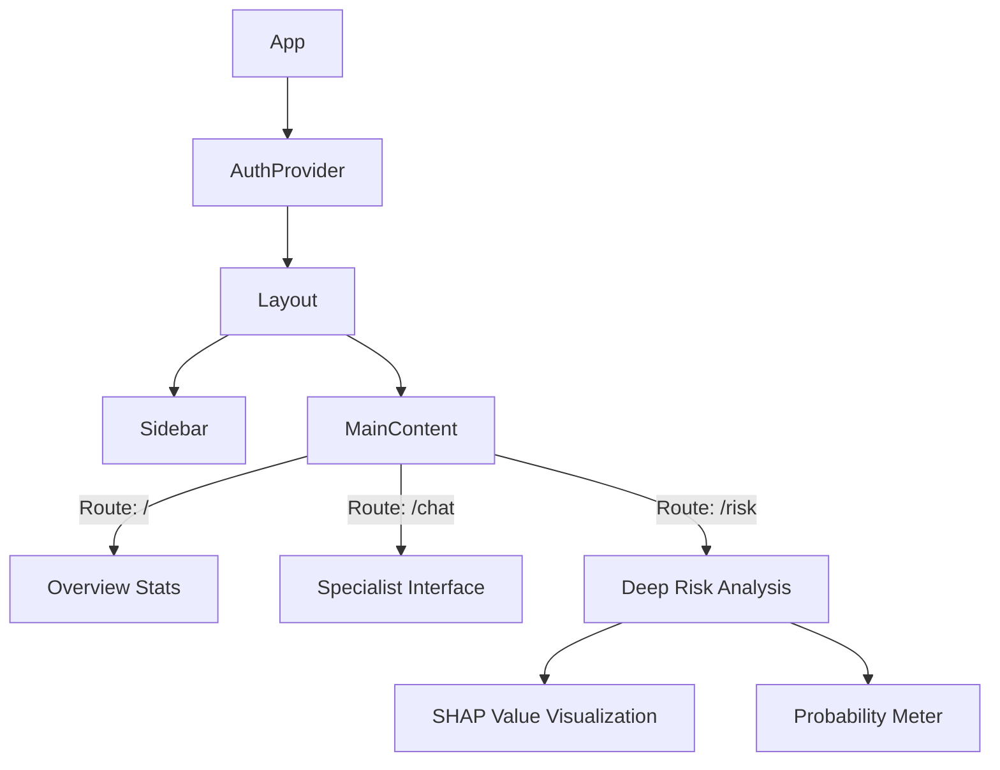

# Aether Web: Clinical Dashboard

A high-performance React web application for doctors and administrators to visualize patient population health.

---

## Dashboard Architecture

The web client serves as the analytical powerhouse of the Aether ecosystem. Unlike the mobile app which focuses on individual care, the web client focuses on aggregate data and detailed medical views.

### Component Hierarchy

---

## Key Features

### 1. Dynamic Factor Correlation (FactorImpact.jsx)
Visualizes which specific health metrics (e.g., Age > 60, Cholesterol > 240) contributed most to a specific risk prediction. This explains the "Why" behind the AI's decision.

### 2. Specialist Chat Interface
A dedicated chat view allowing doctors to simulate or review patient conversations with specific AI personas (Cardiologist, Neurologist).

### 3. Holographic Data Cards
Custom UI components (GlassCard, TiltCard) that present dense medical data in a readable, highly aesthetic format using TailwindCSS.

---

## Technology Stack

- **Core**: React 18 + Vite
- **Styling**: TailwindCSS + Framer Motion (for transitions)
- **State Management**: React Context API
- **Build Tool**: Vite (optimized for speed)

---
*Optimized for Desktop and Tablet Viewports.*
