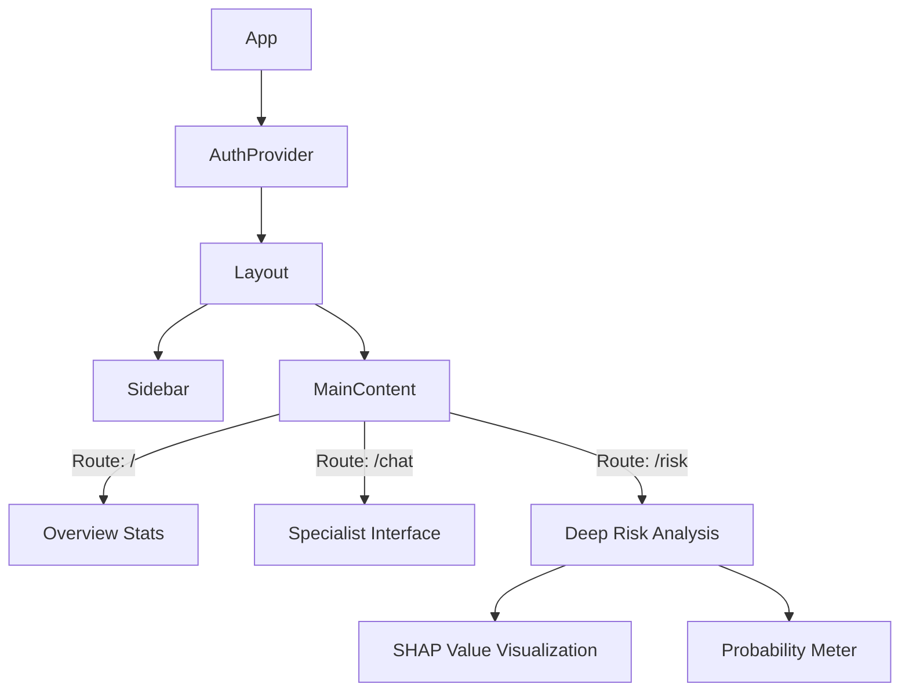

# Aether Web: Clinical Dashboard

A high-performance React web application for doctors and administrators to visualize patient population health.

---

## Dashboard Architecture

The web client serves as the analytical powerhouse of the Aether ecosystem. Unlike the mobile app which focuses on individual care, the web client focuses on aggregate data and detailed medical views.

### Component Hierarchy

```mermaid
graph TD
    App --> AuthProvider
    AuthProvider --> Layout
    Layout --> Sidebar
    Layout --> MainContent
    
    MainContent -->|Route: /| Dashboard["Overview Stats"]
    MainContent -->|Route: /chat| DoctorChat["Specialist Interface"]
    MainContent -->|Route: /risk| HeartRisk["Deep Risk Analysis"]
    
    HeartRisk --> FactorImpact["SHAP Value Visualization"]
    HeartRisk --> ResultGauge["Probability Meter"]
```

---

## Key Features

### 1. Dynamic Factor Correlation (FactorImpact.jsx)
Visualizes which specific health metrics (e.g., Age > 60, Cholesterol > 240) contributed most to a specific risk prediction. This explains the "Why" behind the AI's decision.

### 2. Specialist Chat Interface
A dedicated chat view allowing doctors to simulate or review patient conversations with specific AI personas (Cardiologist, Neurologist).

- **Live progress**: the chat calls `POST /api/chat/stream` (`src/utils/chatStream.js`) and shows each step as it happens ("Searching clinical protocols..."). The reply itself arrives once, after the server's safety checks.
- **Numbered sources**: citations are shown as `[1] Protocol title`, matching the `(Source: [1])` markers in the reply.
- **Report context**: after a report is analysed, a short digest is kept in this browser only (`src/utils/reportContext.js`, 30 days) and sent with chat messages so the assessment can take it into account.

### 3. Agentic features in the UI
- **Report → consultation**: when the report agent finds out-of-range values, the report page shows a button that opens a chat with the suggested specialist and the values ready in the message box.
- **Check-in** (`/followup/:token`): the page behind the emailed link. "Better" ends it; "same" or "worse" continues into a new consultation.
- **Health memory** (Settings): switch long-term memory on or off, see the saved summaries, delete them.
- **Clinician review** (`/review`): the queue of assessments waiting for release, with approve, edit and reject. Needs the server's reviewer key.
- **Waiting state**: while a clinician has the draft, the chat shows "awaiting clinician review" and checks for the result every 15 seconds.

### 4. Holographic Data Cards
Custom UI components (GlassCard, TiltCard) that present dense medical data in a readable, highly aesthetic format using TailwindCSS.

---

## Technology Stack

- **Core**: React 19 + Vite
- **Styling**: TailwindCSS (CSS transitions)
- **State Management**: React Context API
- **Build Tool**: Vite (optimized for speed)

---
*Optimized for Desktop and Tablet Viewports.*
