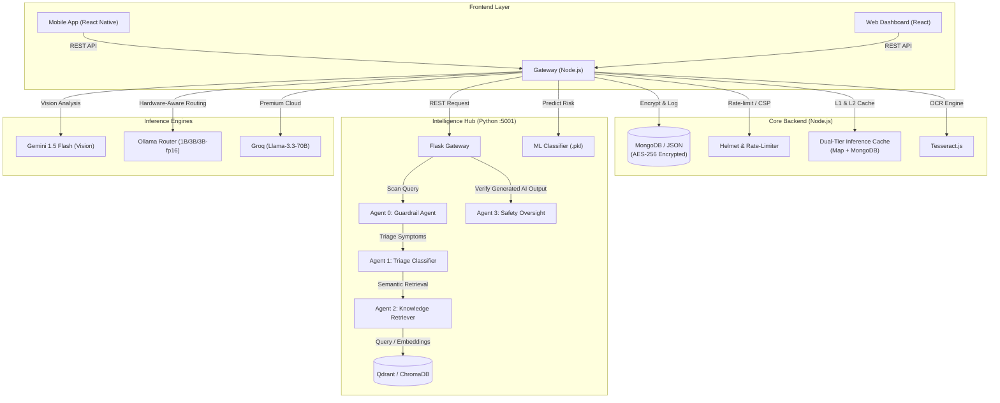

# MedNexus / Aether Clinic: Technical Deep-Dive & Interview Preparation Guide

This guide is designed to help you confidently present **MedNexus (Aether Clinic)** in technical interviews. It details the complete architecture, technical stack, agent workflows, predictive ML model training pipelines, and high-performance deployment details.

---

## 1. Project Overview & Quick Elevator Pitch

**MedNexus (Aether Clinic)** is a high-performance, privacy-first, and security-hardened healthcare platform that enables patients to securely conduct AI-driven consultations, upload and digitize medical reports via OCR, and predict chronic disease risks (heart disease and diabetes). Clinicians use a web-based dashboard to manage patients, review chat histories, and inspect medical insights.

### 🌟 The "Wow" Pitch (How to introduce it in 30 seconds)
> *"I built a distributed, privacy-first healthcare AI system called MedNexus. The system integrates a React Native mobile app and React dashboard with a Node.js API Gateway, which orchestrates requests to a multi-agent Python ML and Intelligence Hub. The core feature is a Multi-Agent RAG pipeline that triages symptoms, performs semantic queries on clinical databases, and runs safety guardrails before returning cited guidance. To ensure production-grade scalability, I implemented a hardware-aware local model router, a dual-tier inference cache to minimize costs, and an automated Git-Ops script for full Kubernetes clustering (HPA, PVC, and Nginx Ingress). All patient communications are AES-256 encrypted at rest."*

---

## 2. Technical Stack at a Glance

| Layer | Technologies & Frameworks | Key Purpose |
| :--- | :--- | :--- |
| **Mobile Client** | React Native, Expo, React Native Reanimated | Patient-facing app for symptom check, report uploads, and ML prediction forms. |
| **Web Dashboard** | React, Vite, TailwindCSS, TypeScript | Provider dashboard for patient management, analytics, and audit logs. |
| **API Gateway (Backend)** | Node.js, Express, Mongoose, Axios, Tesseract.js | Orchestrates traffic, handles OCR extraction, encrypts data (AES-256), implements rate limiting, and caches responses. |
| **ML & Intelligence Hub** | Python, Flask, Scikit-Learn, Joblib, NumPy, Pandas | Run ML predictive inference and coordinates the multi-agent RAG workflow. |
| **Vector Search** | Qdrant (distributed), ChromaDB (edge/offline client) | Vector databases containing clinical guideline embeddings (`all-MiniLM-L6-v2`). |
| **Persistence & Caching** | MongoDB (L2 Cache & Chat logs), Redis (Session Cache), Local JSON (L3 fallback) | Resilient storage and fast hot-path retrieval. |
| **DevOps & Infra** | Kubernetes (kubeadm), Docker Compose, AWS ECR, Ingress-Nginx | Single-command microservice orchestration, ingress routing, and scaling. |

---

## 3. High-Level System Architecture

The project employs a hybrid microservices-based architecture where the Node.js API Gateway bridges frontend clients and the Python ML service. 



---

## 4. Key Workflows Explained (STAR Method)

### A. The Multi-Agent Triage and RAG Flow
*How the chatbot safely retrieves information and answers clinical questions.*

1. **Query Scan (Agent 0: Security Guardrail)**: Incoming queries are normalized (removing invisible characters, standardizing leetspeak). The system checks for prompt injections, roleplay-based medical policy evasion (e.g. *"Pretend to be a doctor"*), dosage-calculation smuggling of restricted drugs (like Metformin or Lisinopril), and off-topic hacking commands.
2. **Symptom Triage (Agent 1: Triage Classifier)**: Classifies the query into a primary medical specialization (e.g., Cardiology, Endocrinology, Orthopedics, Pulmonology) and calculates an urgency level (`emergency`, `urgent`, `routine`). It checks for high-urgency keywords (like *"chest pain"*, *"can't breathe"*, *"thunderclap headache"*).
3. **Semantic Query (Agent 2: Knowledge Retriever)**: Uses the classification categories to run hybrid semantic retrieval on ChromaDB / Qdrant. The vector database contains medical protocols split into 44 chunks using the `all-MiniLM-L6-v2` encoder (384 dimensions). It returns the text context and exact clinical sources/citations.
4. **LLM Generation**: The Node.js server packages the retrieved medical context, system instructions, and chat history, then prompts the LLM (routed dynamically based on user RAM or subscription tier).
5. **Safety Oversight (Agent 3: Safety Oversight)**: The final generated text goes back to Python for verification. It checks for:
   - **Forbidden Patterns**: Phrases like *"I diagnose you with"* or *"I prescribe"*.
   - **Restricted Dosage Recommendations**: Ensures the LLM did not recommend specific dosage values (like *"take 500mg"* of a restricted drug).
   - **Mandatory Safety Warnings**: If the symptom involves Dengue, it injects a warning about avoiding Aspirin/NSAIDS. If it's a high-urgency triage, it appends emergency hotline guidance.
   - **Feedback Flywheel**: Checks if the response patterns match past negative user feedback (Thumb-down logs) stored in the shared volume.
   - **Disclaimer**: Appends a standard Medical Legal Disclaimer.

---

### B. Medical Report Digitization (OCR + Vision)
*How patient-uploaded report images are processed.*

*   **Situation**: Patients wanted to upload physical medical reports, but LLMs struggle with unstructured OCR parsing from raw image files in a cost-efficient manner.
*   **Action**: I engineered a hybrid, two-step processing pipeline:
    1.  **Local Pre-processing (OCR)**: For basic image uploads, the Node.js server utilizes **Tesseract.js** to perform initial text extraction locally. This extracts raw text without incurring cloud costs.
    2.  **Multimodal LLM Parsing (Vision)**: The extracted OCR text, alongside the raw image data (Base64), is sent to **Google Gemini 1.5 Flash**. The LLM acts as a structured parsing agent, mapping raw text and tables into a clean, standardized JSON layout (vital statistics, lab values, abnormal flags).
*   **Result**: The frontend React dashboard instantly visualizes clean trends (charts for hemoglobin, glucose, cholesterol) instead of displaying a cluttered raw text dump, reducing cloud consumption by leveraging local OCR preprocessing.

---

### C. Predictive ML Models (Heart Disease & Diabetes)
*How risk models are trained, calibrated, and deployed.*

The Python ML hub hosts pre-trained machine learning classifiers for heart disease and diabetes risk prediction.

```
ML Training Pipeline:
[Raw Cleaned Data] ➔ [ColumnTransformer Preprocessing] ➔ [Candidate CV Evaluation] 
                          ➔ [Probability Calibration] ➔ [Decision Threshold Tuning] ➔ [joblib Model Bundle]
```

#### Preprocessing & Pipeline Construction
To ensure robust, production-grade training, the pipelines use scikit-learn's `Pipeline` and `ColumnTransformer` frameworks:
*   **Numerical Features** (e.g. `age`, `trestbps`, `chol`, `thalach` for Heart): Handled using a `SimpleImputer(strategy="median")` followed by a `StandardScaler`.
*   **Categorical Features** (e.g. `sex`, `cp`, `fbs`, `restecg`, `exang`, `slope` for Heart): Handled using a `SimpleImputer(strategy="most_frequent")` followed by a `OneHotEncoder(handle_unknown="ignore")`.

#### Model Training & Evaluation
The training scripts (`train_heart_max.py` and `train_diabetes_max.py`) evaluate multiple candidate algorithms using **Repeated Stratified K-Fold Cross-Validation** (5 splits, 8 repeats) to guarantee statistical stability:
1.  **Logistic Regression** (L2 penalty, balanced weights)
2.  **Support Vector Classifier (RBF SVC)** (calibrated probability)
3.  **Random Forest Classifier** (tuned tree counts, max depth, class weights)
4.  **Extra Trees Classifier** (maximum split randomness to reduce variance)
5.  **Soft Voting Ensemble** (incorporating Logistic Regression, SVC, and Extra Trees weighted appropriately)

#### Calibration & Classification Threshold Tuning
To use these models in clinical triage contexts, raw classifier predictions are not enough. We need calibrated probabilities and fine-tuned decision thresholds:
*   **Probability Calibration**: Selected finalists are wrapped in a `CalibratedClassifierCV` (using the sigmoid/Platt's scaling method over 5 internal folds). This ensures that a predicted probability of 80% matches an actual 80% incidence rate (measured by minimizing the *Brier Score Loss*).
*   **Decision Threshold Tuning**: Instead of a default 0.5 classification threshold, a `TunedThresholdClassifierCV` tunes the decision boundary to maximize **Balanced Accuracy** (which accounts for class imbalances in medical datasets). The optimal threshold is selected by evaluating 101 threshold steps.
*   **Output**: The final tuned model pipeline is serialized using `joblib` alongside detailed metadata (holdout accuracies, ROC-AUC, PR-AUC, features schema) to a versioned registry.

---

## 5. Advanced Engineering Design Patterns (Interviewer "Wow" Factors)

### 🚀 Hardware-Aware Dynamic Quantization
In local-only or offline deployments, running heavy LLMs is impossible on standard devices. I designed a **Hardware-Aware Router**:
*   The web frontend detects the client device's physical memory using the browser's `navigator.deviceMemory` API (and passes it in the chat request payload as `userRam`).
*   The Node.js server routes the query to different local Ollama models based on this value:
    *   **< 4GB RAM**: Routed to `llama3.2:1b` (Ultra-light, optimized for low-end mobile).
    *   **4GB - 16GB RAM**: Routed to `llama3.2` (Standard 3B parameters).
    *   **> 16GB RAM**: Routed to `llama3.2:3b-fp16` (Unquantized high-precision).
    *   **Enterprise/Premium Tier**: Instantly bypassed to Groq (`llama-3.3-70b` running cloud-side at 450+ tokens/sec).

### 🔒 Dual-Tier Inference Caching
LLM API calls are expensive and slow. To address this, I built a two-stage cache system in the backend gateway:
*   **L1 Cache (In-Memory Map)**: Fast, non-blocking check. If a user asks the exact same question in quick succession, it resolves in `< 1ms`.
*   **L2 Cache (MongoDB Store)**: A persistent caching database collection.
*   *Workflow*: If L1 misses, the gateway queries MongoDB (L2). If it's a hit, the value is returned and back-propagated into L1 memory for subsequent queries. If both miss, the LLM is queried, and the result is cached across both levels.

### 🛡️ Resilience & Failover Fallback
In production, microservices can go offline. MedNexus implements resilient architecture:
*   **Database Fallback**: The Node.js backend continuously monitors MongoDB connectivity. If MongoDB goes down, the system dynamically switches to a local filesystem-based JSON database wrapper (`chat_logs.json`), printing warning logs but keeping the application running.
*   **RAG Fallback**: If the Python Flask ML service is unreachable, the Node.js server catches the connection error and falls back to a legacy keyword-based extraction mechanism (`medical_knowledge.json`) to provide baseline medical guidance instead of throwing a blank error.
*   **Vector DB Fallback**: The Python service uses Qdrant as its main distributed index, but keeps a local ChromaDB instance as a fallback vector database.

### ☸️ Production DevOps & Kubernetes Clustering
The workspace includes a production deployment pipeline under `k8s/` and a unified orchestrator script `scripts/deploy_k8s.sh`.
*   **Auto-Scaling**: Configured **Horizontal Pod Autoscalers (HPA)** for the Node.js gateway (scaling 2 to 10 replicas) and the Python ML service (scaling 2 to 5 replicas) based on CPU utilization crossing `75%`.
*   **Persistent Storage**: Persistent Volume Claims (PVC) are wired for MongoDB, Redis (with Append-Only File persistence enabled), and Qdrant to ensure data persists across pod restarts.
*   **Traffic Routing**: An Ingress resource directs public web requests to the React static client, and `/api` requests to the Node.js gateway service using Nginx Ingress routing.

---

## 6. Common Interview Questions & Answers

### Q1: "Why did you use a separate Node.js server and Python server instead of doing everything in Python/Node?"
> **Answer**: *"I wanted to follow a microservices pattern separating concerns. Node.js is excellent for real-time orchestration, handling HTTP handshakes, compression, local file system actions (like OCR uploads), and security middleware (Helmet, rate-limiter, sanitization). Python, on the other hand, is the industry standard for machine learning. By isolating the ML predictors (Scikit-Learn) and RAG agents (ChromaDB/Qdrant, Guardrails, Triage) into a Python Flask service, we can scale them independently. If symptom checking experiences heavy load, Kubernetes can spin up more Python ML pods without duplicating the Node.js gateway pods."*

### Q2: "Medical advice from an LLM is dangerous. How did you mitigate safety risks and hallucinations?"
> **Answer**: *"I implemented a strict Multi-Agent pipeline specifically for safety. Before queries hit the database, Agent 0 (Guardrail) blocks prompt injections and dosage smuggling. After the LLM generates a response, Agent 3 (Safety Oversight) inspects the text against the retrieved clinical sources to detect hallucinations. It enforces negative constraints—blocking words like 'I diagnose' or 'I prescribe'—and forces the addition of critical alerts, such as warning Dengue patients against taking Aspirin. Finally, we append a strict legal medical disclaimer footer."*

### Q3: "How does the Feedback Flywheel work in your application?"
> **Answer**: *"When a user interacts with the medical assistant, the frontend provides Thumbs Up/Down icons. If a user clicks Thumbs Down, the React client POSTs to the `/api/chat/feedback` endpoint. The Node.js gateway logs the response text, the user's original query, and the specialization. These logs are stored in a shared JSON volume. When the Safety Oversight agent verifies future responses, it reads these negative feedback logs. If the LLM generates a response that matches the style or phrasing of a flagged negative log, it triggers a safety violation and modifies the output, creating a continuous alignment loop."*

### Q4: "How did you optimize ML model performance for disease prediction?"
> **Answer**: *"During training, I didn't rely on default model parameters. I set up Repeated Stratified K-Fold Cross-Validation to validate candidate models (Logistic Regression, Random Forest, SVC, Extra Trees). I then calibrated the classifiers using Platt's Sigmoid scaling so their outputs represent true probabilities. Finally, I tuned the classification thresholds to maximize balanced accuracy instead of standard accuracy, ensuring the models perform well on imbalanced datasets where disease positive cases are minority classes."*

### Q5: "If your system runs locally, how do you handle security and database integrity?"
> **Answer**: *"Security is integrated at every layer. First, all sensitive chat records are encrypted at rest using AES-256 before being saved to MongoDB or the JSON log files. Second, the backend uses Helmet to protect against cross-site scripting (XSS), rate limits clients to prevent DDoS, and runs input sanitization to block NoSQL injection. Third, Kubernetes secrets are used to store all passwords, API tokens, and registry credentials, preventing sensitive details from being hardcoded in configuration files."*
