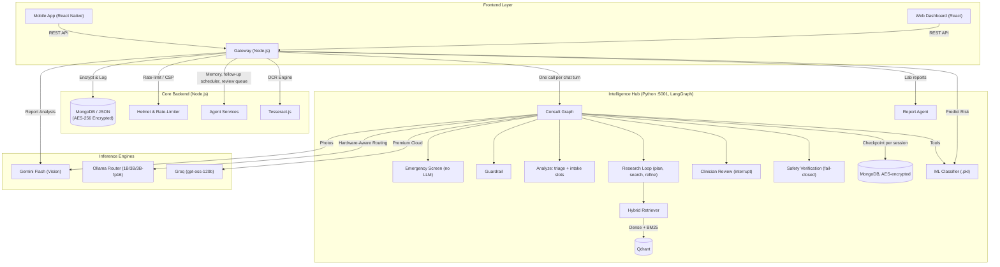

# MedNexus / Aether Clinic: Technical Deep-Dive & Interview Preparation Guide

This guide is designed to help you confidently present **MedNexus (Aether Clinic)** in technical interviews. It details the complete architecture, technical stack, agent workflows, predictive ML model training pipelines, and high-performance deployment details.

---

## 1. Project Overview & Quick Elevator Pitch

**MedNexus (Aether Clinic)** is a high-performance, privacy-first, and security-hardened healthcare platform that enables patients to securely conduct AI-driven consultations, upload and digitize medical reports via OCR, and predict chronic disease risks (heart disease and diabetes). Clinicians use a web-based dashboard to manage patients, review chat histories, and inspect medical insights.

### 🌟 The "Wow" Pitch (How to introduce it in 30 seconds)
> *"I built a privacy-first healthcare AI system called MedNexus. A React Native app and a React dashboard talk to a Node.js gateway, and a Python service runs each consultation as a LangGraph state machine: it screens for emergencies before any model is called, collects the history with structured output, retrieves clinical protocols from Qdrant with hybrid search, and only shows a reply after it has passed fail-closed safety checks. Around that I built the agentic parts: a research agent that plans one search per problem and refines searches that find nothing, hand-off between specialist profiles, a lab-report agent whose range checks are rule-based tools, long-term patient memory, an opt-in follow-up agent, and a human-in-the-loop review step using LangGraph interrupts. Conversation state is checkpointed per session in MongoDB, AES-encrypted. I measured retrieval and emergency detection on gold sets instead of guessing, and the whole stack deploys to Kubernetes with autoscaling."*

---

## 2. Technical Stack at a Glance

| Layer | Technologies & Frameworks | Key Purpose |
| :--- | :--- | :--- |
| **Mobile Client** | React Native, Expo, React Native Reanimated | Patient-facing app for symptom check, report uploads, and ML prediction forms. |
| **Web Dashboard** | React, Vite, TailwindCSS, TypeScript | Provider dashboard for patient management, analytics, and audit logs. |
| **API Gateway (Backend)** | Node.js, Express, Mongoose, Axios, Tesseract.js | Validates requests, handles OCR extraction, encrypts transcripts (AES-256), rate-limits, relays streaming progress, and forwards each chat turn to the Python service. |
| **ML & Intelligence Hub** | Python, Flask, LangGraph, langchain-openai, Scikit-Learn, Joblib | Runs the consultation graph (emergency screen, intake, retrieval, assessment, safety verification) and the risk models, which are also exposed to the graph as tools. |
| **Vector Search** | Qdrant (server mode, or embedded in-memory mode) | One collection with a dense vector (`all-MiniLM-L6-v2`) and a BM25 sparse vector per chunk, for hybrid search. |
| **Persistence** | MongoDB (chat logs and, encrypted, consultation state, patient memory, review queue, check-ins), Local JSON (transcript and memory fallback) | Resilient storage; consultation state is shared by all ML replicas. |
| **DevOps & Infra** | Kubernetes (kubeadm), Docker Compose, AWS ECR, Ingress-Nginx | Single-command microservice orchestration, ingress routing, and scaling. |

---

## 3. High-Level System Architecture

The project employs a hybrid microservices-based architecture where the Node.js API Gateway bridges frontend clients and the Python ML service. 


```mermaid
graph TD
    subgraph "Frontend Layer"
        M["Mobile App (React Native)"] -->|REST API| G["Gateway (Node.js)"]
        W["Web Dashboard (React)"] -->|REST API| G
    end

    subgraph "Core Backend (Node.js)"
        G -->|Encrypt & Log| F[("MongoDB / JSON\n(AES-256 Encrypted)")]
        G -->|Rate-limit / CSP| X["Helmet & Rate-Limiter"]
        G -->|Memory, follow-up scheduler, review queue| C["Agent Services"]
        G -->|OCR Engine| T["Tesseract.js"]
    end

    subgraph "Intelligence Hub (Python :5001, LangGraph)"
        G -->|One call per chat turn| CG["Consult Graph"]
        CG --> ES["Emergency Screen (no LLM)"]
        CG --> GR["Guardrail"]
        CG --> AN["Analyze: triage + intake slots"]
        CG --> RS["Research Loop (plan, search, refine)"]
        RS --> KR["Hybrid Retriever"]
        CG --> HR["Clinician Review (interrupt)"]
        G -->|Lab reports| RA["Report Agent"]
        KR -->|Dense + BM25| VDB[("Qdrant")]
        CG --> SO["Safety Verification (fail-closed)"]
        CG -->|Checkpoint per session| CK[("MongoDB, AES-encrypted")]
        CG -->|Tools| ML["ML Classifier (.pkl)"]
        G -->|Predict Risk| ML
    end

    subgraph "Inference Engines"
        G -->|Report Analysis| G15["Gemini Flash (Vision)"]
        CG -->|Photos| G15
        CG -->|Hardware-Aware Routing| OL["Ollama Router (1B/3B/3B-fp16)"]
        CG -->|Premium Cloud| GRQ["Groq (gpt-oss-120b)"]
    end
```

---

## 4. Key Workflows Explained (STAR Method)

### A. The Consultation Graph (LangGraph)
*How the chatbot collects a history, retrieves information and answers safely.*

One chat turn is one run of a state machine. Each step is a node; edges decide what happens next.

1. **Emergency screen (no model)**: A keyword layer with negation handling runs first. "Crushing chest pain" returns a fixed, reviewed message with emergency numbers in under a second; "no chest pain" does not trigger. Self-harm always gets the crisis reply. Each kind is announced once, then the consultation continues as urgent.
2. **Guardrail**: Queries are normalized (invisible characters, leetspeak) and checked for prompt injection, roleplay evasion, dosage-calculation smuggling and off-topic requests. A blocked message is not kept in the conversation.
3. **Analyze (structured output)**: One JSON-mode call returns intent, category, urgency and the intake slots: complaint, location, duration, severity, character, triggers, associated symptoms, history. Two guards stop the model from steering the flow: a slot value the user never said is dropped, and "the user wants the assessment" is only believed if the user's words support it. If no model answers, regex rules take over.
4. **Ask or assess**: Decided from the slots, not a turn counter. It asks one question at a time until it knows the complaint, the duration and three more details, or the user asks for the assessment, or six turns pass.
5. **Research (agent loop)**: The analyze step also writes a research plan: one search phrase per distinct problem the user mentioned. Each is run through hybrid search in Qdrant (dense cosine plus a weighted BM25 bonus) and graded `strong`, `weak` or `none`. A search that finds nothing is reworded by the model, which is told what was already found, and tried once more. Results are merged so each topic keeps its best match. Off-topic context is never used or cited.
6. **Risk tools**: If the topic fits and the user gave numbers, the model may call the heart or diabetes risk model as a tool. Values the user did not state, and values outside the training range, are rejected.
7. **Assess**: The model writes the five-section assessment (or a direct answer to a health question) from the intake, the protocols and any tool results, citing sources inline.
8. **Verify (fail closed)**: Rule checks for diagnosis claims, prescription doses, dangerous instructions, personal data and previously down-voted replies; a format check; and, for hosted models, a second call that lists clinical claims not backed by the protocols. A rejected draft is regenerated once. If it fails again the user gets a safe fallback, never the draft. Mandatory warnings (for example dengue and NSAIDs) are added when missing.

**Hand-off**: every category has a specialist profile (focus areas, red flags to ask about). If a heart-clinic chat turns out to be about a knee injury, the conversation is handed to the Bone Specialist with a one-line note, at most twice per consultation.

**Clinician review (optional)**: with review mode on, the graph calls `interrupt()` after verification. The run is checkpointed, the user sees a waiting note, and a clinician approves, edits or rejects the draft in a review queue. The gateway then resumes the same run with that decision.

**State**: a LangGraph checkpointer saves the conversation per session in MongoDB, AES-encrypted, one record per chat with a 30-day expiry. Photos and report digests travel in the run config and are never checkpointed.

**Streaming**: the client sees each step as it starts ("Searching clinical protocols..."). The reply text is sent only after verification.

**Measured** (`python -m evals.run_evals`): on 48 patient-style questions the right protocol was the top hit 96% of the time and always in the context; 8 of 8 off-topic questions were rejected; on 8 two-topic messages, one search per topic found both protocols 8 times against 6 for a single search; 26 of 26 emergency messages were caught with no false alarms on 14 ordinary ones. Be upfront that these are small, self-written regression sets.

---

### B. The Lab-Report Agent (OCR + Vision + a rule-based tool)
*How patient-uploaded report images are processed.*

*   **Situation**: Patients upload photos of lab reports. The first version sent OCR text and the image to one model call and trusted whatever came back, including which values were "abnormal". When that call failed it returned placeholder findings marked "simulated".
*   **Action**: I rebuilt it as a four-step agent in the Python service:
    1.  **Extract**: Tesseract.js does OCR in the gateway. A vision model reads the image into a table of test, value, unit and printed range. The OCR text is kept out of that prompt on purpose.
    2.  **Check (tool)**: a deterministic function compares each value with the range printed on the report, or with a small fallback table when the unit matches. A model never decides whether a value is high or low.
    3.  **Explain**: a model writes a short summary and next steps from the checked table.
    4.  **Verify**: the same rule checks the chat uses; on failure a rule-written summary is used.
*   **Guards**: every extracted number must be on the page, checked against the OCR text while ignoring the decimal point. If only OCR is available the result carries a clear caution. If nothing can read the report the user gets an error, not made-up results.
*   **Result**: out-of-range values come with the range they were checked against, and the page offers a one-click consultation with the right specialist about them.
*   **Story worth telling**: the first real end-to-end run showed OCR dropping decimal points, so "HbA1c 7.9 %, range 4.0–5.6" was read as range "40–56" and reported as *low*, and creatinine 1.9 became 19. The vision model was also copying those mistakes because I had put the OCR text in its prompt. Removing the OCR text from the prompt and using it only as a cross-check fixed both.

---

### C. Predictive ML Models (Heart Disease & Diabetes)
*How risk models are trained, calibrated, and deployed.*

The Python ML hub hosts pre-trained machine learning classifiers for heart disease and diabetes risk prediction.

```
ML Training Pipeline:
[Raw Cleaned Data] ➔ [ColumnTransformer Preprocessing] ➔ [Candidate CV Evaluation] 
                          ➔ [Probability Calibration] ➔ [Decision Threshold Tuning] ➔ [joblib Model Bundle]
```

#### Preprocessing & Pipeline Construction
To ensure robust, production-grade training, the pipelines use scikit-learn's `Pipeline` and `ColumnTransformer` frameworks:
*   **Numerical Features** (e.g. `age`, `trestbps`, `chol`, `thalach` for Heart): Handled using a `SimpleImputer(strategy="median")` followed by a `StandardScaler`.
*   **Categorical Features** (e.g. `sex`, `cp`, `fbs`, `restecg`, `exang`, `slope` for Heart): Handled using a `SimpleImputer(strategy="most_frequent")` followed by a `OneHotEncoder(handle_unknown="ignore")`.

#### Model Training & Evaluation
The training scripts (`train_heart_max.py` and `train_diabetes_max.py`) evaluate multiple candidate algorithms using **Repeated Stratified K-Fold Cross-Validation** (5 splits, 8 repeats) to guarantee statistical stability:
1.  **Logistic Regression** (L2 penalty, balanced weights)
2.  **Support Vector Classifier (RBF SVC)** (calibrated probability)
3.  **Random Forest Classifier** (tuned tree counts, max depth, class weights)
4.  **Extra Trees Classifier** (maximum split randomness to reduce variance)
5.  **Soft Voting Ensemble** (incorporating Logistic Regression, SVC, and Extra Trees weighted appropriately)

#### Calibration & Classification Threshold Tuning
To use these models in clinical triage contexts, raw classifier predictions are not enough. We need calibrated probabilities and fine-tuned decision thresholds:
*   **Probability Calibration**: Selected finalists are wrapped in a `CalibratedClassifierCV` (using the sigmoid/Platt's scaling method over 5 internal folds). This ensures that a predicted probability of 80% matches an actual 80% incidence rate (measured by minimizing the *Brier Score Loss*).
*   **Decision Threshold Tuning**: Instead of a default 0.5 classification threshold, a `TunedThresholdClassifierCV` tunes the decision boundary to maximize **Balanced Accuracy** (which accounts for class imbalances in medical datasets). The optimal threshold is selected by evaluating 101 threshold steps.
*   **Output**: The final tuned model pipeline is serialized using `joblib` alongside detailed metadata (holdout accuracies, ROC-AUC, PR-AUC, features schema) to a versioned registry.

---

## 5. Advanced Engineering Design Patterns (Interviewer "Wow" Factors)

### 🚀 Hardware-Aware Dynamic Quantization
In local-only or offline deployments, running heavy LLMs is impossible on standard devices. I designed a **Hardware-Aware Router**:
*   The web frontend detects the client device's physical memory using the browser's `navigator.deviceMemory` API (and passes it in the chat request payload as `userRam`).
*   The Python service's model router picks a local Ollama model from this value:
    *   **< 4GB RAM**: `llama3.2:1b` (Ultra-light, optimized for low-end mobile).
    *   **4GB - 16GB RAM**: `llama3.2` (Standard 3B parameters).
    *   **> 16GB RAM**: `llama3.2:3b-instruct-fp16` (Unquantized high-precision).
    *   **Premium Tier**: Groq first (`openai/gpt-oss-120b`, configurable with `GROQ_MODEL`).
*   Every provider is called through its OpenAI-compatible endpoint, so one client class covers Ollama, Groq and Gemini. The order is Ollama → Groq → Gemini for the basic tier and Groq → Gemini → Ollama for premium. A provider that is unreachable or misconfigured is skipped for 60 seconds.
*   *Story worth telling*: the previous Groq model (`llama-3.3-70b-versatile`) was retired by the provider and the premium tier silently fell back to Gemini. The first real end-to-end run caught it. Model names are now configuration, and a wrong one cools the provider down instead of failing every call.

### 🧠 Long-Term Memory, Follow-Ups and Human in the Loop
*   **Patient memory**: when a consultation finishes, the graph returns a summary built only from the intake slots (what the user said, never model text). The gateway keeps the last ten per user, AES-encrypted, and sends a digest with later consultations as background. Users can switch it off and delete it.
*   **Follow-up agent**: opt-in check-in two days after an assessment. A scheduler claims each due check-in atomically (`findOneAndUpdate`), so several replicas never email twice; failed sends are retried three times. The email has a link and no health details. Answering "worse" opens a new consultation that starts from the earlier complaint and goes through every safety step again.
*   **Human in the loop**: LangGraph `interrupt()` pauses a verified assessment for a clinician. The paused state survives restarts because it is in the checkpointer, and resuming does not call the model again.
*   **Why replies are not cached**: an earlier version cached model replies by prompt. Replies now depend on conversation state and the user's own data, so a cache would hand one person another person's answer. The cache module is no longer on any request path.

### 🛡️ Resilience & Failover
In production, microservices can go offline. The rule here is: degrade where it is safe, refuse where it is not.
*   **Database Fallback**: If MongoDB is down, the Node.js backend switches to a local JSON store (`chat_logs.json`) for transcripts.
*   **Model Fallback**: If one model provider fails, the router tries the next. If none answers, intake still works with regex extraction and scripted questions, and emergencies and the guardrail work as normal. An assessment is declined rather than faked.
*   **State Recovery**: The gateway sends the last ten messages with every turn. If the Python service has lost its state (restart, expiry), it rebuilds the conversation from that transcript.
*   **No unsafe fallback**: If the Python service is unreachable, the gateway returns a clear "temporarily unavailable" message. The older design fell back to a keyword lookup plus an unverified model call in Node; that path was removed because it skipped the safety checks.
*   **Vector store**: One store (Qdrant). With a server configured the service uses it; otherwise it builds the same index in memory at startup. There is no second database to keep in sync.

### ☸️ Production DevOps & Kubernetes Clustering
The workspace includes a production deployment pipeline under `k8s/` and a unified orchestrator script `scripts/deploy_k8s.sh`.
*   **Auto-Scaling**: Configured **Horizontal Pod Autoscalers (HPA)** for the Node.js gateway (1 to 10 replicas) and the Python ML service (1 to 5 replicas) based on CPU utilization crossing `75%`. ML replicas can scale freely because consultation state lives in MongoDB, not in the pod.
*   **Persistent Storage**: Persistent Volume Claims (PVC) are wired for MongoDB, Redis (with Append-Only File persistence enabled), and Qdrant to ensure data persists across pod restarts.
*   **Traffic Routing**: An Ingress resource directs public web requests to the React static client, and `/api` requests to the Node.js gateway service using Nginx Ingress routing.

---

## 6. Common Interview Questions & Answers

### Q1: "Why did you use a separate Node.js server and Python server instead of doing everything in Python/Node?"
> **Answer**: *"I wanted to separate concerns. Node.js handles what it is good at: HTTP, uploads, OCR, security middleware, encrypted transcripts and relaying a stream to the browser. Python is the standard for ML, so the risk models and the whole consultation flow (LangGraph, retrieval, safety checks) live in one Python service. An earlier version split the chat logic across both, with Node deciding the flow and Python doing retrieval and verification over two HTTP calls per turn. I moved it into one graph so a single place owns the conversation state. Now Node makes one call per turn and Kubernetes can scale the Python pods independently."*

### Q2: "Medical advice from an LLM is dangerous. How did you mitigate safety risks and hallucinations?"
> **Answer**: *"In layers, and the layers fail closed. First, emergencies never reach a model: a keyword screen returns a fixed, reviewed message. Second, a guardrail blocks prompt injection and dosage smuggling. Third, retrieval is graded, so off-topic context is never used. Fourth, every draft passes rule checks for diagnosis claims, prescription doses and personal data, and for hosted models a second call lists clinical claims that are not in the retrieved protocols. A rejected draft is regenerated once; if it fails again the user gets a safe fallback, not the draft. If the checker itself crashes, nothing is shown. I also do not stream tokens: the browser only receives text after verification. And I don't let the model control the flow: intake values the user never said are dropped, and the risk tools reject any number the user did not type."*

### Q3: "How does the Feedback Flywheel work in your application?"
> **Answer**: *"When a user interacts with the medical assistant, the frontend provides Thumbs Up/Down icons. If a user clicks Thumbs Down, the React client POSTs to the `/api/chat/feedback` endpoint. The Node.js gateway logs the response text, the user's original query, and the specialization. These logs are stored in a shared JSON volume. When the verify step checks a new draft, it reads the most recent negative logs. If the draft repeats a flagged reply, that counts as a violation and the draft is regenerated. It is a simple text match today; the natural next step is a semantic similarity check."*

### Q4: "How did you optimize ML model performance for disease prediction?"
> **Answer**: *"During training, I didn't rely on default model parameters. I set up Repeated Stratified K-Fold Cross-Validation to validate candidate models (Logistic Regression, Random Forest, SVC, Extra Trees). I then calibrated the classifiers using Platt's Sigmoid scaling so their outputs represent true probabilities. Finally, I tuned the classification thresholds to maximize balanced accuracy instead of standard accuracy, ensuring the models perform well on imbalanced datasets where disease positive cases are minority classes."*

### Q5: "If your system runs locally, how do you handle security and database integrity?"
> **Answer**: *"Security is integrated at every layer. First, all sensitive chat records are encrypted at rest using AES-256 before being saved to MongoDB or the JSON log files. Second, the backend uses Helmet to protect against cross-site scripting (XSS), rate limits clients to prevent DDoS, and runs input sanitization to block NoSQL injection. Third, Kubernetes secrets are used to store all passwords, API tokens, and registry credentials, preventing sensitive details from being hardcoded in configuration files."*

### Q6: "Why LangGraph? Couldn't this be a few function calls?"
> **Answer**: *"The flow has real branches and a loop: emergency or not, ask or assess, retry a rejected draft once. A state machine makes those explicit and testable. LangGraph also gave me three things I would otherwise have built by hand: a checkpointer, so state survives across HTTP turns and is shared between replicas; streaming of node progress to the UI; and tracing. I kept the nodes as plain functions that receive their dependencies, so the test suite runs the real graph against a scripted model in a few seconds with no API keys."*

### Q7: "How do you know your retrieval works?"
> **Answer**: *"I measured it. I wrote 48 patient-style questions with the protocol each should find, plus off-topic questions that should find nothing. Then I compared dense, sparse, hybrid, three cross-encoder rerankers and two medical embedding models. The honest result: on a 17-protocol corpus the reranker and the medical embeddings did not help, so they are off. Hybrid ranks the same as dense, but it separates on-topic from off-topic much better, because an exact-term question like 'reduced ejection fraction' scores low on dense similarity alone. That separation is what lets me grade context and refuse to cite irrelevant protocols. The eval runs in CI as a regression gate. It is a small self-written set, so I treat it as a regression check, not a benchmark."*

### Q8: "What did real end-to-end testing find that unit tests missed?"
> **Answer**: *"Several things. The premium model had been retired by the provider. A small local model set the 'user wants the assessment' flag on its own and ended interviews after one message, and filled slots with 'n/a' to skip questions, so I added guards that check the model's claims against the user's actual words. It also echoed prompt scaffolding into replies, and once returned a follow-up question where the final assessment should be, which would have closed the session; there is now a format check. The embedding model was running on the laptop GPU and took close to a second per query; on CPU it takes a few milliseconds. And the stock MongoDB checkpointer stores node outputs in plain-text metadata even with an encrypted serializer, which I only found by reading the raw documents in a test."*

### Q9: "What would you do next?"
> **Answer**: *"Real authentication first: today the gateway trusts a client-supplied user id, and CORS is open. Then grow the corpus and re-run the evals, because that is when a reranker starts to pay off. Then an independent, clinician-written eval set, and a semantic check for the feedback loop instead of a text match."*

### Q10: "You call it agentic. Where does the model actually decide something?"
> **Answer**: *"In four places, and I can say exactly where it does not. It writes the research plan, deciding how many separate problems there are and what to search for each. It rewrites searches that found nothing, after being told what was found. It decides whether to call a risk-model tool and with which arguments. And it classifies the complaint, which drives the hand-off between specialists. It does not decide whether a message is an emergency, whether a draft is safe to show, whether a lab value is abnormal, or when a consultation is released under review mode. Those are rules, tools or a human. I think that split is the honest way to use agents in a medical product: let the model research and write, and keep the decisions that can hurt someone out of its hands."*

### Q11: "How does the human-in-the-loop step work technically?"
> **Answer**: *"The review node calls LangGraph's `interrupt()` with the draft and the intake. That raises inside the node, the graph stops, and the checkpointer saves the state, encrypted in MongoDB. The HTTP request returns a waiting message. The draft goes into a review queue. When a clinician decides, the gateway calls resume, which invokes the graph with `Command(resume=decision)`; the node runs again, `interrupt()` now returns the decision, and the graph continues to the final step. Because the state is in the checkpointer, a different replica can resume it, and no model call is repeated. I tested that against a real MongoDB with two service instances."*

### Q12: "How do you stop the follow-up emails from going out twice when you scale?"
> **Answer**: *"Each due check-in is claimed with a single atomic `findOneAndUpdate` that flips its status from pending to sending. Only one replica can win that update. If the sender crashes after claiming, the claim goes stale after fifteen minutes and is picked up again. I have a test that runs three schedulers at once over eight due check-ins and asserts exactly eight emails."*
