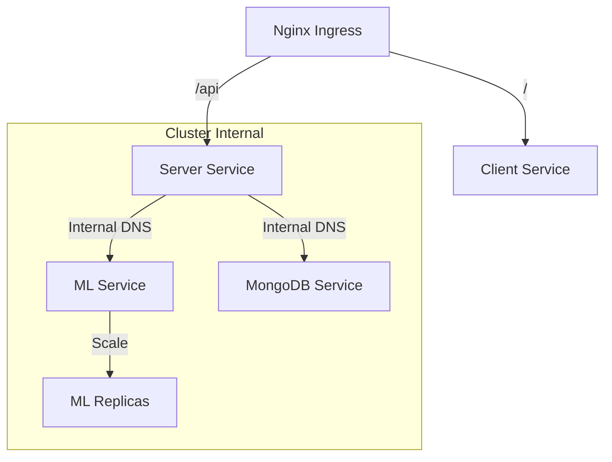

# Aether K8s: Kubernetes Deployment

Manifests for orchestrating the Aether Clinic microservices in a production environment.

---

## Cluster Topology

The application uses a standard 3-tier Kubernetes deployment strategy.

---

## Deployment Resources

### 1. Core Services
- **backend-deployment.yaml**: Deploys the Node.js API server. Configured with readiness/liveness probes.
- **client-deployment.yaml**: Serves the React Web Client (Nginx container).
- **ml-deployment.yaml**: Deploys the Python Flask service.

### 2. Infrastructure
- **mongo-statefulset.yaml**: Manages the database persistence with Persistent Volume Claims (PVC).
- **ingress.yaml**: Routes external HTTP traffic to the appropriate internal services.

---

## Scalability

- **Horizontal Pod Autoscaling (HPA)**: Configured to scale the Node.js backend based on CPU utilization exceeding 70%.
- **Rolling Updates**: Zero-downtime deployment strategy enables seamless updates.

---
*Orchestrating Healthcare infrastructure at Scale.*
