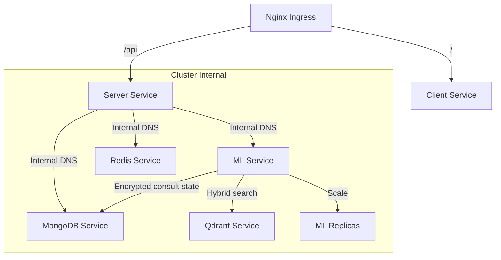

# Aether K8s: Kubernetes Deployment

Manifests for orchestrating the Aether Clinic microservices in a production environment.

---

## Cluster Topology

The application uses a standard 3-tier Kubernetes deployment strategy.

```mermaid
graph TD
    Ingress["Nginx Ingress"] -->|/api| Server["Server Service"]
    Ingress -->|/| Client["Client Service"]
    
    subgraph "Cluster Internal"
        Server -->|Internal DNS| ML["ML Service"]
        Server -->|Internal DNS| Mongo["MongoDB Service"]
        Server -->|Internal DNS| Redis["Redis Service"]
        ML -->|Hybrid search| Qdrant["Qdrant Service"]
        ML -->|Encrypted consult state| Mongo
        ML -->|Scale| Pods["ML Replicas"]
    end
```

---

## Deployment Resources

### 1. Core Services
- **backend-deployment.yaml**: Deploys the Node.js API server. Configured with readiness/liveness probes.
- **client-deployment.yaml**: Serves the React Web Client (Nginx container).
- **ml-deployment.yaml**: Deploys the Python service (risk models + the LangGraph consultation flow). Needs `QDRANT_HOST`, `MONGO_URI` and `ENCRYPTION_KEY`; `GEMINI_API_KEY` and the optional `groq-api-key` come from `aether-secrets`.
  Optional: `REVIEW_MODE` (`off`, `urgent`, `all`) to hold assessments for a clinician.
- **backend**: optional `REVIEWER_KEY` (clinician review queue), `APP_URL` (links in check-in emails) and `EMAIL_USER` / `EMAIL_PASS`. The check-in scheduler is safe with several backend replicas.
- **ml-job.yaml**: One-off job that indexes the medical corpus into Qdrant (`python -m retrieval.ingest`). Safe to re-run. The service also indexes on first start if the collection is empty.

### 2. Infrastructure
- **mongo-deployment.yaml**: MongoDB with a Persistent Volume Claim (PVC). Holds users, chat transcripts and the encrypted consultation state.
- **qdrant-deployment.yaml**: Qdrant vector database (pinned to `v1.16.1`, matching the client library) with a PVC.
- **redis-deployment.yaml**: Redis cache for the gateway.
- **ingress.yaml**: Routes external HTTP traffic to the appropriate internal services.

---

## Scalability

- **Horizontal Pod Autoscaling (HPA)**: `hpa.yaml` scales the Node.js backend (1 to 10 replicas) and the ML service (1 to 5 replicas) when CPU utilization exceeds 75%.
- **ML replicas share state**: consultation state lives in MongoDB, so any ML pod can serve the next turn of a chat. Each pod runs one gunicorn worker with threads; scale with replicas, not workers.
- **Rolling Updates**: Zero-downtime deployment strategy enables seamless updates.

---
*Orchestrating Healthcare infrastructure at Scale.*
