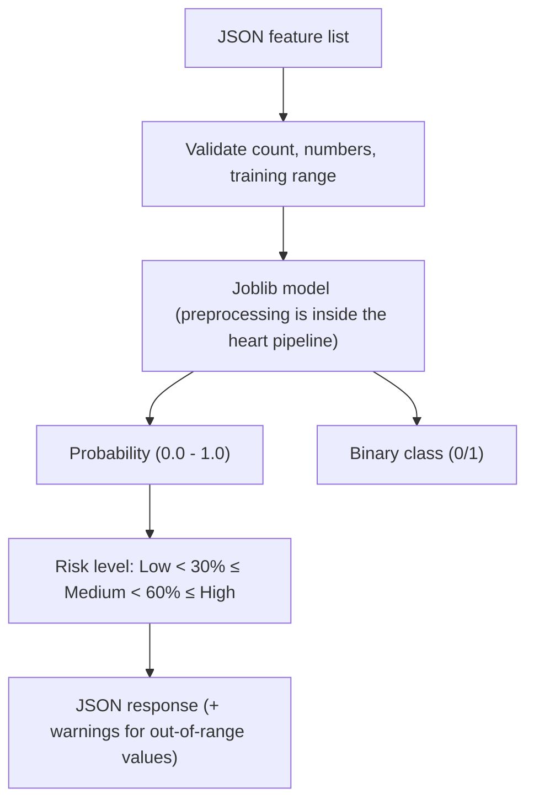

# Aether ML: Consultation & Predictive Analytics Service

**The Python microservice behind the chat consultation and the risk predictions.**

---

## Consultation Service

One chat turn is one run of a LangGraph state machine:

```
screen (emergency + guardrail) → analyze (triage + intake + research plan) → ask a question
                                                                           → research ⇄ refine → [risk tools] → assess
                                                                             → verify (safety) → [clinician review] → reply
```

Full description, measured retrieval numbers and configuration:
[../docs/ARCHITECTURE.md](../docs/ARCHITECTURE.md).

| Folder | What is in it |
|:--|:--|
| `consult/` | The graph: state, nodes, prompts, emergency screen, intake rules, research loop, specialist profiles, clinician review, LLM router, risk tools, state storage |
| `report/` | Lab-report agent: extract values, rule-based range check, explain, verify |
| `retrieval/` | Corpus chunking, embeddings, BM25 sparse vectors, Qdrant access, ingestion |
| `agents/` | Rule-based guardrail, keyword triage, output safety checks |
| `evals/` | Gold question sets and the offline eval runner |
| `tests/` | pytest suite (no API keys needed) |
| `data/medical_corpus/` | The 17 clinical protocols that are indexed |

### Running

```bash
pip install -r requirements.txt
python app.py                         # http://localhost:5001
python -m pytest tests -q             # tests
python -m evals.run_evals --compare   # retrieval and emergency-screen numbers
python -m retrieval.ingest            # (re)index the corpus when a Qdrant server is configured
```

Settings come from environment variables (see `.env.example`). For local development
the service also reads `../server/.env`, so keys only have to be set once. With no
Qdrant configured it builds an in-memory index at startup; with no MongoDB it keeps
conversation state in memory.

### Endpoints

| Method | Path | Description |
|:--|:--|:--|
| POST | `/api/consult` | Runs one consultation turn |
| POST | `/api/consult/stream` | Same, as server-sent events (`step`, then `final`) |
| DELETE | `/api/consult/thread/<id>` | Deletes one conversation's saved state |
| GET | `/api/consult/reviews` | Assessments waiting for a clinician (`REVIEW_MODE=urgent` or `all`) |
| POST | `/api/consult/review/<id>` | A clinician's decision; resumes the paused graph |
| POST | `/api/report/analyze` | Lab-report agent |
| POST | `/api/intelligence/query` | Retrieval only |
| POST | `/api/intelligence/verify` | Rule-based safety check for a text |
| GET | `/api/intelligence/status`, `/health` | Status |
| POST | `/predict/heart`, `/predict/diabetes` | Risk predictions |

---

## Risk Models

The risk prediction endpoints do not use LLMs. They use classic machine-learning
models trained on public datasets (Cleveland Heart, PIMA Diabetes). The same
models are available to the consultation as tools, with two guards: a value the
user did not state is rejected, and so is a value outside the training range.

### Processing Pipeline



## Available Models

| Model | Type | Holdout result | Features (in order) |
| :--- | :--- | :--- | :--- |
| **Heart Disease** | Calibrated soft-voting ensemble (Logistic Regression + SVC + Extra Trees) with a tuned decision threshold | accuracy 0.90, ROC-AUC 0.96 (`models/metadata/heart_model_latest.json`) | age, sex, cp (1-4), trestbps, chol, fbs, restecg, thalach, exang, oldpeak, slope (1-3), ca, thal (3/6/7) |
| **Diabetes** | Logistic Regression on raw features | not recorded for the current file | Pregnancies, Glucose, BloodPressure, SkinThickness, Insulin, BMI, DiabetesPedigreeFunction, Age |

> The diabetes metadata file describes a voting ensemble, but the `diabetes_model.pkl`
> currently in `models/` is a plain Logistic Regression. Re-run
> `train/train_diabetes_max.py` if the ensemble is the one you want to ship.

---

## Tech Stack

*   **Framework**: Flask (Python), gunicorn in production
*   **Consultation**: LangGraph, langchain-openai (one client for Ollama, Groq and Gemini)
*   **Retrieval**: Qdrant, Sentence-Transformers (`all-MiniLM-L6-v2`)
*   **ML Libraries**: Scikit-Learn, NumPy, Pandas
*   **Serialization**: Joblib (for `.pkl` model persistence)

---
*Precision Medicine Powered by Math.*
