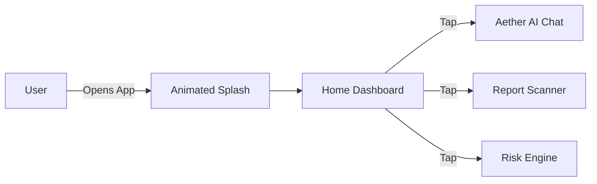

# 📱 Aether Mobile: Patient Companion App

**A futuristic, visually immersive React Native application designed for patient engagement and health tracking.**

---

## 🎨 Design Philosophy: "Aether UI"

The mobile application implements a custom **"Aether" Design System**, focusing on dark-mode aesthetics, holographic gradients, and fluid micro-interactions.

### Key Visual Technologies:
*   **React Native Reanimated**: Powering the *Fireflies*, *Aurora Backgrounds*, and *card tilt* effects.
*   **Expo Haptics**: Providing tactile feedback for "Digital Decoder" text effects and button interactions.
*   **Glassmorphism**: Extensive use of blur views and semi-transparent layers to create depth.

---

## 🧩 Core Mobile Modules

### 1. The Neural Home (Dashboard)
The central hub for the patient. It features a "Sentient Core" that greets the user and dynamic Bento Grid cards for quick navigation.

### 2. Aether AI Chat (`/chat`)
A secure interface for conversational health assistance.
*   **Feature**: Real-time streaming responses.
*   **Visuals**: Voice visualizer animations and "AI typing" indicators.
*   **Safety**: Local red-teaming ensures no medical advice is given as absolute fact.

### 3. Report Vision (`/analyze`)
Allows users to upload medical reports (PDF/Images) for instant breakdown.
*   **Process**: Image -> Base64 -> Backend -> OCR -> Gemini 1.5 Pro -> Structured JSON Summary.

### 4. Risk Engine (`/risk`)
A form-based interface connecting directly to the Python ML Service.
*   **Input**: Age, BP, Cholesterol, etc.
*   **Output**: Real-time "Gauge Animation" showing probability of heart disease.

---

## 🛠️ Tech Stack & Configuration

*   **Framework**: Expo (React Native)
*   **Language**: TypeScript
*   **Network**: Axios (with centralized `Config.ts` for ease of IP switching)
*   **Navigation**: Expo Router (File-based routing)

---
*Designed for iOS and Android.*
