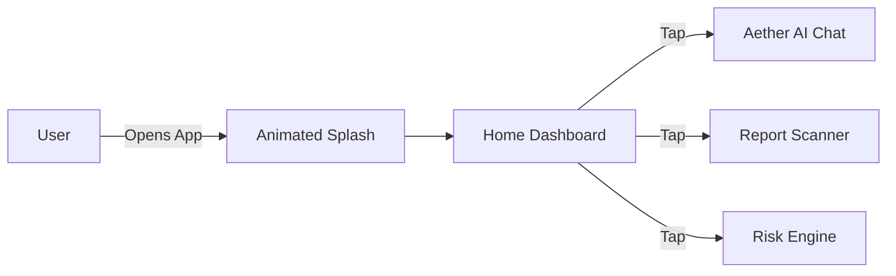

# Aether Mobile: Patient Companion App

A futuristic, visually immersive React Native application designed for patient engagement and health tracking.

---

## Design Philosophy: Aether UI

The mobile application implements a custom design system, focusing on dark modes, glassmorphism, and fluid micro-interactions.

### Key Visual Technologies:
- **React Native Reanimated**: Powering smooth transitions, background effects, and interactive UI elements.
- **Expo Haptics**: Providing tactile feedback for enhanced user engagement.
- **Glassmorphism**: Extensive use of blur effects and semi-transparent layers to create a premium aesthetic.

---

## Core Mobile Modules

### 1. Neural Home (Dashboard)
The central hub for the patient, featuring an AI-driven core and dynamic navigation cards.

### 2. AI Chat
A secure interface for conversational health assistance.
- **Features**: Real-time streaming responses and AI status indicators.
- **Visuals**: Animated voice visualizers and modern typography.
- **Safety**: Built-in safeguards for informational health guidance.

### 3. Report Vision
Enables users to upload and digitize medical reports for instant insights.
- **Process**: Image recognition followed by backend processing and AI-driven summarization.

### 4. Risk Engine
A diagnostic interface connecting to cloud-based machine learning models for risk assessment.

---

## Technology Stack

- **Framework**: Expo (React Native)
- **Language**: TypeScript
- **Network**: Axios
- **Navigation**: Expo Router

---
*Designed for iOS and Android.*
