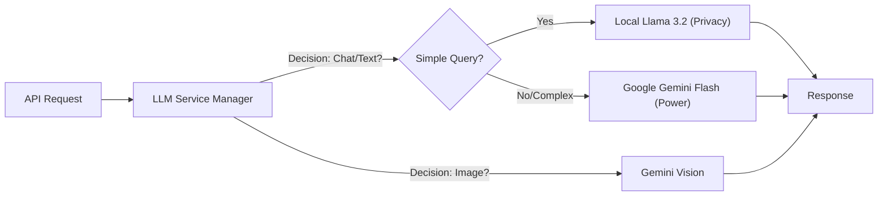

# Aether Core: Node.js Backend

The central orchestration layer handling API requests, security, and intelligence routing.

---

## Hybrid Intelligence Engine

The server implements a smart routing mechanism to choose the best AI model for the task, balancing privacy, cost, and capability.

---

## API Documentation

### 1. Machine Learning Gateway (/api/ml)
Proxies requests to the Python ML microservice.
- `POST /heart`: Forwards structured vector data for cardiac analysis.
- `POST /diabetes`: Forwards vector data for diabetes risk.

### 2. Report Analysis (/api/report)
Handles multi-modal input (Files + Text).
- **OCR Integration**: Uses Tesseract.js for initial text extraction.
- **Vision Fallback**: Uses Gemini Vision if OCR confidence is low.

### 3. Chat System (/api/chat)
Stateful chat endpoint that retrieves user history and injects system prompts based on the selected "Doctor Persona".

---

## Security Measures

- **AES-256 Encryption**: Used for storing sensitive analysis results in MongoDB.
- **Environment Isolation**: API Keys (e.g., GEMINI_API_KEY) are accessed strictly via process.env.
- **CORS Policies**: Strict allow-lists for Mobile and Web Client origins.

---

## Technology Stack

- **Runtime**: Node.js 20+
- **Framework**: Express.js
- **Database**: MongoDB (Mongoose ODM)
- **AI SDKs**: @google/generative-ai, axios (for Ollama)

---
*The Brain of Aether Clinic.*
