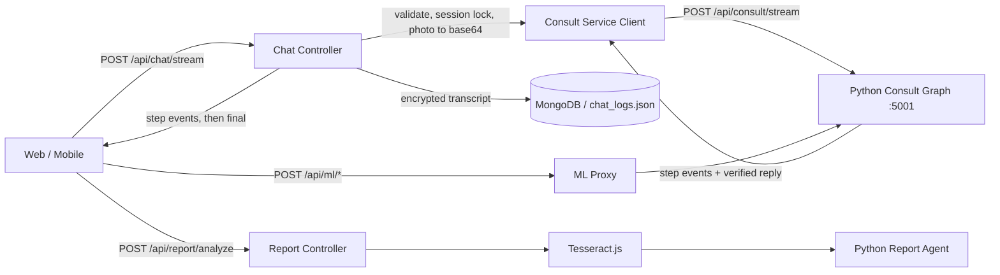

# Aether Core: Node.js Backend

The API gateway: security, uploads, encrypted chat transcripts, report analysis and streaming.

It does **not** generate chat replies. Every chat turn is forwarded to the Python
service, which runs the consultation (see [../docs/ARCHITECTURE.md](../docs/ARCHITECTURE.md)).
If that service is down, the gateway answers `503 ASSISTANT_UNAVAILABLE`.

---

## Request Flow


```mermaid
graph LR
    Client["Web / Mobile"] -->|POST /api/chat/stream| Chat["Chat Controller"]
    Chat -->|validate, session lock, photo to base64| Consult["Consult Service Client"]
    Consult -->|POST /api/consult/stream| Py["Python Consult Graph :5001"]
    Py -->|step events + verified reply| Consult
    Chat -->|encrypted transcript| DB[("MongoDB / chat_logs.json")]
    Chat -->|step events, then final| Client

    Client -->|POST /api/report/analyze| Report["Report Controller"]
    Report --> OCR["Tesseract.js"] --> RA["Python Report Agent"]
    Client -->|POST /api/ml/*| MLProxy["ML Proxy"] --> Py
```

---

## API Documentation

### 1. Chat System (/api/chat)

| Method | Path | What it does |
|:--|:--|:--|
| POST | `/` | One chat turn. Multipart form: `userId`, `message`, `specialization`, `tier`, `userRam`, optional `image`, optional `reportSummary`. Returns `{ reply, sessionComplete, citations, mode }`. |
| POST | `/stream` | Same request as server-sent events: `step` events (`{ step, label }`) while the consultation runs, then one `final` event with the body above, or one `error` event. |
| POST | `/force-final` | Asks for the final assessment now (`{ userId, specialization }`). |
| GET | `/history/:userId/:specialization` | Decrypted transcript plus `sessionClosed`. |
| DELETE | `/history/:userId/:specialization` | Deletes the transcript and the consultation state in the Python service. |
| POST | `/feedback` | Thumbs up / down on a reply. |

Behaviour worth knowing:

- Each chat has a `sessionId`. It is the thread id of the consultation in the Python service. A new chat always gets a new one.
- After a final assessment the session is locked (`sessionClosed`); further messages get `403 SESSION_COMPLETE`.
- One photo per session (`403 IMAGE_LIMIT_REACHED`). Uploads are limited to 8 MB images and the temp file is always removed.
- The last 10 messages are sent with every turn so the Python service can rebuild its state if it was lost.
- Transcripts are stored AES-256 encrypted, in MongoDB when connected and in `chat_logs.json` otherwise.

### 1b. Patient memory, check-ins and clinician review

| Method | Path | What it does |
|:--|:--|:--|
| GET, DELETE | `/api/chat/memory/:userId` | The saved summaries of finished consultations (encrypted at rest), or delete them. |
| POST | `/api/followup` | Opt-in check-in after a finished consultation: `{ userId, specialization, email, days }`. Needs MongoDB. |
| GET | `/api/followup/:token` | What the emailed link shows. |
| POST | `/api/followup/:token/respond` | `{ status: "better" \| "same" \| "worse", note }`. "Same" or "worse" returns an opening message for a new consultation. |
| DELETE | `/api/followup/:token` | Cancels a pending check-in. |
| GET | `/api/review` | Assessments waiting for a clinician. Needs the `x-reviewer-key` header. |
| POST | `/api/review/:threadId` | `{ action: "approve" \| "edit" \| "reject", text, reviewer }`. Resumes the paused consultation and adds the result to the transcript. |

- **Memory**: when a consultation finishes, the Python service returns a summary built from what the user said. The last ten are kept per user and a digest is sent with later turns. `memory=off` in a chat request skips both.
- **Hand-off**: when the conversation moves to another specialist, the note from the Python service is put in front of the reply and stored with it.
- **Review**: while a draft is with a clinician the chat answers `409 REVIEW_PENDING`. The queue is disabled unless `REVIEWER_KEY` is set.
- **Follow-ups**: `services/followUpService.js` checks for due check-ins every ten minutes and claims each one atomically, so replicas never send an email twice. Emails contain a link only.

### 2. Machine Learning Gateway (/api/ml)
Proxies requests to the Python ML microservice.
- `POST /heart`: Forwards 13 features for cardiac risk.
- `POST /diabetes`: Forwards 8 features for diabetes risk.
- `GET /intelligence/status`: Status of the consultation stack (vector index, model providers, state store).

Bad input comes back as `400` with the reason (for example the expected feature order).

### 3. Report Analysis (/api/report)
Handles image uploads of lab reports.
- **OCR**: Tesseract.js extracts the text locally.
- **Report agent**: the text and the image go to the Python report agent, which extracts the values, checks each against its range with a rule-based tool, explains them and suggests a specialist.
- If the agent cannot run, the answer is `503`. No placeholder analysis is returned.
- Reports are not stored on the server.

---

## Security Measures

- **AES-256 Encryption**: Chat messages are encrypted before they are stored.
- **Helmet, rate limiting, input sanitization** on all routes.
- **Environment Isolation**: API keys are read from `process.env` only.
- **Known gaps**: there is no real authentication yet (the client-supplied `userId` is trusted), and CORS currently accepts every origin. Fix both before exposing this publicly.

---

## Running and Testing

```bash
npm install
npm run dev        # http://localhost:5050 (needs the Python service on :5001 for chat)
npm test           # gateway tests against a stub consult service; writes only to a temp folder
TEST_MONGO_URI=mongodb://localhost:27017 npm test   # also runs the follow-up tests (no email is sent)
```

Environment variables are listed in `.env.example`. `INTELLIGENCE_BASE_URL` (or `ML_BASE_URL`) points at the Python service.

---

## Technology Stack

- **Runtime**: Node.js 20+
- **Framework**: Express.js
- **Database**: MongoDB (Mongoose ODM), JSON file fallback
- **AI**: all model calls are made by the Python service

---
*The Gateway of Aether Clinic.*
